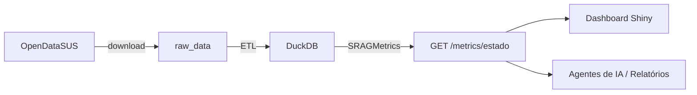

# SRAG Data Health Agent Monitor

API em FastAPI para ingestão, tratamento e disponibilização de dados de **SRAG** (Síndrome Respiratória Aguda Grave) do [OpenDataSUS](https://opendatasus.saude.gov.br/). O sistema faz o download dos datasets brutos, executa um pipeline de ETL, persiste os dados tratados em **DuckDB** e expõe **métricas de saúde** por estado ou para todo o Brasil.

## O que o sistema faz

1. **Download** — Baixa arquivos CSV de SRAG a partir de URLs configuradas e salva em `raw_data/`. Arquivos já presentes são reutilizados, sem novo download.
2. **ETL** — Faz merge dos CSVs, seleciona colunas relevantes, filtra registros inválidos, trata valores ausentes e deriva variáveis de período (`ANO_NOTIFIC`, `MES_NOTIFIC`).
3. **Persistência** — Grava o dataset tratado no DuckDB (`data/srag.duckdb`), na tabela `srag_notificacoes`.
4. **Pipeline** — Orquestra download + ETL em uma única chamada.
5. **Métricas** — Calcula taxa de aumento de casos, mortalidade, ocupação de UTI e vacinação COVID para cada UF ou para o Brasil (`BRASIL`).
6. **Dashboard** — Interface web em [Shiny for Python](https://shiny.posit.co/py/) para visualizar as métricas de forma interativa.

### Endpoints principais

| Método | Caminho | Descrição |
|--------|---------|-----------|
| `GET` | `/health` | Health check da API |
| `POST` | `/datasets/download` | Download dos datasets |
| `POST` | `/datasets/etl` | Executa o ETL |
| `POST` | `/datasets/pipeline` | Download + ETL (fluxo completo) |
| `GET` | `/metrics/{estado}` | Retorna as 4 métricas SRAG para uma UF ou `BRASIL` |

Documentação interativa (Swagger): [http://localhost:8000/docs](http://localhost:8000/docs)

### Exemplo de consulta de métricas

```bash
# Todo o Brasil
curl http://localhost:8000/metrics/BRASIL

# Estado específico
curl http://localhost:8000/metrics/SP
```

## Arquitetura

O projeto segue o padrão **MVC**:

| Camada | Responsabilidade | Exemplos |
|--------|------------------|----------|
| **Views** (`app/views/`) | Rotas HTTP | `dataset_routes.py`, `metrics_routes.py` |
| **Controllers** (`app/controllers/`) | Orquestração | `pipeline_controller.py`, `metrics_controller.py` |
| **Services** (`app/services/`) | Regras de negócio | `etl_service.py`, `srag_metrics.py` |
| **Models** (`app/models/`) | Schemas Pydantic | `metrics.py`, `etl.py` |



## Executando com Docker

### Pré-requisitos

- [Docker](https://docs.docker.com/get-docker/) e Docker Compose instalados

### 1. Configurar variáveis de ambiente

```bash
cp .env.example .env
```

Ajuste o `.env` se necessário. Os valores padrão já funcionam para desenvolvimento local.

### 2. Subir a aplicação

```bash
docker compose up -d --build
```

### 3. Verificar se a API está no ar

```bash
curl http://localhost:8000/health
```

Resposta esperada: `{"status":"ok"}`

Documentação da API: [http://localhost:8000/docs](http://localhost:8000/docs)

### 4. Executar o pipeline de dados

```bash
curl -X POST http://localhost:8000/datasets/pipeline
```

Ou acesse a [documentação interativa da API](http://localhost:8000/docs) e execute `POST /datasets/pipeline` pela interface Swagger.

### 5. Abrir o dashboard

Com a API e o pipeline em execução, acesse:

**http://localhost:8080**

O dashboard permite selecionar uma UF ou `BRASIL` e visualiza as quatro métricas em cards, gráficos e tabela detalhada.

### 6. Consultar métricas via API

Após o pipeline, consulte as métricas:

```bash
curl http://localhost:8000/metrics/BRASIL
curl http://localhost:8000/metrics/SP
```

### 7. Parar a aplicação

```bash
docker compose down
```

### Volumes

| Pasta local | Destino no container | Conteúdo |
|-------------|----------------------|----------|
| `./raw_data` | `/app/raw_data` | CSVs brutos do OpenDataSUS |
| `./data` | `/app/data` | Banco DuckDB (`srag.duckdb`) |

### Serviços Docker

| Serviço | Container | Porta | Descrição |
|---------|-----------|-------|-----------|
| `api` | `srag-api` | `8000` | API FastAPI |
| `dashboard` | `srag-dashboard` | `8080` | Dashboard Shiny |

## Dashboard Shiny (local)

Com a API em execução na porta 8000:

```bash
pip install -r requirements.txt
shiny run shiny_app/app.py --host 127.0.0.1 --port 8080
```

Variável opcional: `API_BASE_URL` (padrão: `http://127.0.0.1:8000`).

## Testes

Na raiz do projeto:

```bash
pip install -r requirements.txt
pytest
```

A suíte inclui **44 testes** cobrindo download, ETL, cálculo de métricas e endpoint `/metrics/{estado}`.

## Documentação

- **API (Swagger UI):** [http://localhost:8000/docs](http://localhost:8000/docs)

Informações mais detalhadas estão na pasta [`docs/`](docs/):

| Documento | Conteúdo |
|-----------|----------|
| [`docs/etl_pipeline.md`](docs/etl_pipeline.md) | Pipeline completo: download, ETL, arquitetura, configuração e exemplos |
| [`docs/metricas_srag.md`](docs/metricas_srag.md) | Cálculo das métricas SRAG, escopo por UF/Brasil, endpoint da API, fórmulas e cenários |

## Stack

- **FastAPI** — API HTTP
- **httpx** — Download assíncrono dos datasets
- **pandas** — Transformação dos dados no ETL
- **DuckDB** — Armazenamento analítico
- **Shiny for Python** — Dashboard interativo de métricas
- **Plotly** — Gráficos no dashboard
- **Docker** — Containerização
