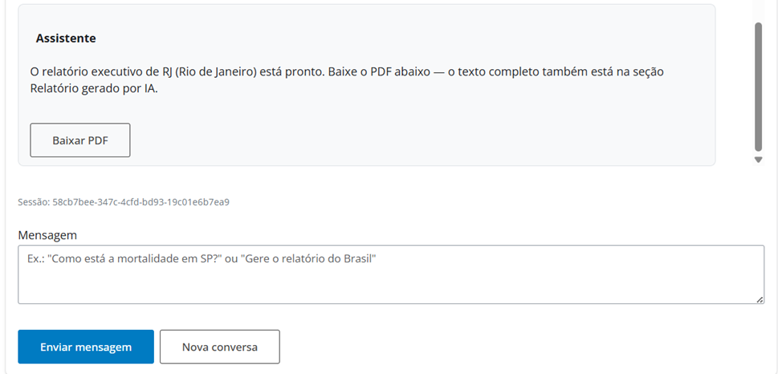
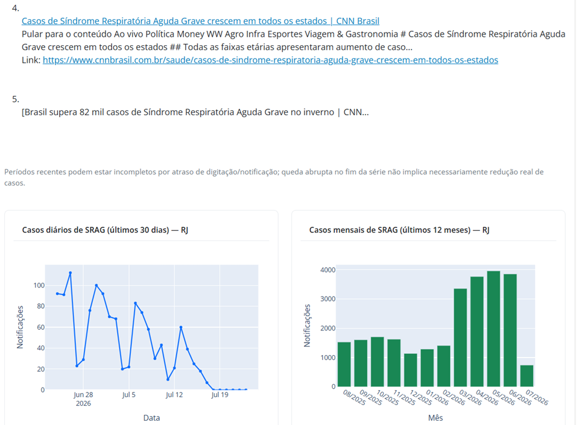
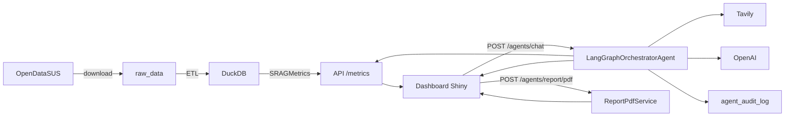

# SRAG Data Health Agent Monitor

Solução para monitoramento de **SRAG** (Síndrome Respiratória Aguda Grave) com dados do [OpenDataSUS](https://opendatasus.saude.gov.br/). O projeto executa download e ETL dos datasets, persiste os dados em **DuckDB**, expõe **métricas de saúde** via **FastAPI**, disponibiliza um **agente chatbot web em [http://localhost:8080](http://localhost:8080)** e inclui um **agente de IA** que gera resumos executivos com dados oficiais e notícias (**Tavily Search**), com download em **PDF**.





## Visão geral

Esta PoC responde a uma pergunta prática: como transformar dados públicos de SRAG em uma interface analítica com métricas, séries temporais, chatbot e relatório automatizado por IA.

O sistema entrega cinco blocos principais:

- **Pipeline de dados**: baixa os CSVs do OpenDataSUS e prepara os dados para análise.
- **API de métricas**: expõe indicadores por UF ou para `BRASIL`.
- **Dashboard web**: frontend em Shiny (chatbot + relatório gerado por IA).
- **Orquestrador LangGraph**: tool calling dinâmico (métricas, séries, gráficos, notícias, relatório).
- **Auditoria**: trilha de governança das execuções do agente no DuckDB.

## O que o sistema faz

1. **Download** — Baixa quatro arquivos CSV de SRAG (2019–2026) a partir de URLs no `.env` e salva em `raw_data/`. Arquivos já presentes são reutilizados.
2. **ETL** — Merge dos CSVs, seleção de colunas, filtros, tratamento de ausentes e derivação de `ANO_NOTIFIC` / `MES_NOTIFIC`.
3. **Persistência** — Grava o dataset tratado no DuckDB (`data/srag.duckdb`), tabela `srag_notificacoes`.
4. **Pipeline** — Orquestra download + ETL em uma única chamada.
5. **Métricas** — Taxa de aumento de casos, mortalidade, ocupação de UTI e vacinação COVID (UF ou `BRASIL`).
6. **Dashboard** — Interface Shiny em **[http://localhost:8080](http://localhost:8080)** com chatbot e seção de relatório.
7. **Chatbot / relatório** — Orquestrador único (`LangGraphOrchestratorAgent`) com tools dinâmicas, Tavily e `ChartSpec`; relatório em prosa + tabela de métricas + notícias com links; exportação PDF (ReportLab).
8. **Auditoria** — Cada chat/relatório grava evento em `agent_audit_log` (consultável via API).

## Acesso rápido

- **Dashboard:** [http://localhost:8080](http://localhost:8080)
- **API:** [http://localhost:8000](http://localhost:8000)
- **Swagger / OpenAPI:** [http://localhost:8000/docs](http://localhost:8000/docs)

No dashboard, peça análises ou um relatório no **chatbot** (informe a UF ou Brasil). O texto completo e os gráficos aparecem em **Relatório gerado por IA**; no chat surge uma bolha com **Baixar PDF** quando o relatório fica pronto.

## Endpoints principais

| Método | Caminho | Descrição |
|--------|---------|-----------|
| `GET` | `/health` | Health check da API |
| `POST` | `/datasets/download` | Download dos datasets |
| `POST` | `/datasets/etl` | Executa o ETL |
| `POST` | `/datasets/pipeline` | Download + ETL (fluxo completo) |
| `GET` | `/datasets/status` | Informa se os dados já estão prontos |
| `GET` | `/metrics/{estado}` | 4 métricas SRAG (UF ou `BRASIL`) |
| `GET` | `/metrics/{estado}/casos-diarios` | Série diária (últimos 30 dias) |
| `GET` | `/metrics/{estado}/casos-mensais` | Série mensal (últimos 12 meses) |
| `POST` | `/agents/chat` | Chatbot LangGraph (métricas, notícias, relatório) |
| `POST` | `/agents/report` | Relatório executivo one-shot (API) |
| `POST` | `/agents/report/pdf` | Exporta relatório já gerado em PDF |
| `GET` | `/agents/audit` | Lista eventos de auditoria |
| `GET` | `/agents/audit/session/{session_id}` | Trilha de uma sessão |
| `GET` | `/agents/audit/{audit_id}` | Detalhe de um evento |

### Exemplos

```bash
curl http://localhost:8000/metrics/BRASIL
curl http://localhost:8000/metrics/SP

curl -X POST http://localhost:8000/agents/chat \
  -H "Content-Type: application/json" \
  -d "{\"message\":\"Gere o relatório executivo do Brasil\"}"

# Exporta PDF a partir de um relatório já gerado (estado + resumo + charts)
curl -X POST http://localhost:8000/agents/report/pdf \
  -H "Content-Type: application/json" \
  -d "{\"estado\":\"BRASIL\",\"resumo_executivo\":\"...\",\"charts\":[]}" \
  --output relatorio_srag_BRASIL.pdf

curl "http://localhost:8000/agents/audit?limit=10"
```

## Arquitetura

Padrão **MVC**:

| Camada | Responsabilidade | Exemplos |
|--------|------------------|----------|
| **Views** (`app/views/`) | Rotas HTTP | `dataset_routes.py`, `metrics_routes.py`, `agent_routes.py` |
| **Controllers** (`app/controllers/`) | Orquestração HTTP | `pipeline_controller.py`, `metrics_controller.py`, `agent_controller.py` |
| **Services** (`app/services/`) | Regras de negócio | `etl_service.py`, `srag_metrics.py`, `langgraph_orchestrator_agent.py`, `report_pdf_service.py`, `agent_audit_service.py` |
| **Models** (`app/models/`) | Schemas Pydantic | `metrics.py`, `chat.py`, `agent.py`, `audit.py`, `chart.py` |



Mais detalhes: [`docs/arquitetura_solucao_srag.md`](docs/arquitetura_solucao_srag.md) e [`docs/agente_orquestrador.md`](docs/agente_orquestrador.md).

## Executando com Docker

### Pré-requisitos

- [Docker](https://docs.docker.com/get-docker/) e Docker Compose

### 1. Configurar ambiente

```bash
cp .env.example .env
```

Configure `OPENAI_API_KEY` e `TAVILY_API_KEY`. Após alterar o `.env`, use `docker compose up -d --force-recreate` (o `restart` não recarrega variáveis).

### 2. Subir a aplicação

```bash
docker compose up -d --build
```

### 3. Health check

```bash
curl http://localhost:8000/health
```

### 4. Pipeline de dados

```bash
curl -X POST http://localhost:8000/datasets/pipeline
```

### 5. Dashboard

**http://localhost:8080**

- Chatbot para perguntas pontuais ou pedido de relatório (UF / Brasil)
- Bolha dinâmica **Baixar PDF** no próprio chat quando há relatório
- Seção **Relatório gerado por IA** (texto completo + gráficos SRAG Plotly)
- Escopo e período são informados pelo agente no chat

### 6. Chat / relatório / auditoria via API

```bash
curl -X POST http://localhost:8000/agents/chat \
  -H "Content-Type: application/json" \
  -d "{\"message\":\"Qual a mortalidade no Brasil?\"}"

curl -X POST http://localhost:8000/agents/report \
  -H "Content-Type: application/json" \
  -d "{\"estado\":\"SP\"}"

curl "http://localhost:8000/agents/audit?limit=10"
```

### 7. Parar

```bash
docker compose down
```

### Volumes e serviços

| Pasta local | Destino no container | Conteúdo |
|-------------|----------------------|----------|
| `./raw_data` | `/app/raw_data` | CSVs brutos |
| `./data` | `/app/data` | DuckDB (`srag.duckdb` + `agent_audit_log`) |

| Serviço | Container | Porta | Descrição |
|---------|-----------|-------|-----------|
| `api` | `srag-api` | `8000` | FastAPI |
| `dashboard` | `srag-dashboard` | `8080` | Shiny |

### Logs

```bash
docker logs srag-api
docker logs -f srag-api --tail 50
docker logs srag-dashboard
```

Nível controlado por `LOG_LEVEL` (padrão `INFO`).

## Executando o dashboard localmente

Com a API na porta 8000:

```bash
pip install -r requirements.txt
shiny run shiny_app/dashboard.py --host 127.0.0.1 --port 8080
```

Variável opcional: `API_BASE_URL` (padrão `http://127.0.0.1:8000`).

## Testes

```bash
pip install -r requirements.txt
pytest
```

A suíte cobre download, ETL, métricas, rotas, Tavily, OpenAI, orquestrador LangGraph, chat/report, exportação PDF e auditoria.

## Documentação

| Documento | Conteúdo |
|-----------|----------|
| [`docs/Resumo_Arquitetura_Solucao.md`](docs/Resumo_Arquitetura_Solucao.md) | Resumo do README, arquitetura e funcionamento do orquestrador |
| [`docs/arquitetura_solucao_srag.md`](docs/arquitetura_solucao_srag.md) | Arquitetura conceitual (frontend, API, LangGraph, tools, LLM, DuckDB, Tavily, auditoria) |
| [`docs/etl_pipeline.md`](docs/etl_pipeline.md) | Download, ETL, configuração e exemplos |
| [`docs/metricas_srag.md`](docs/metricas_srag.md) | Cálculo das métricas, escopo UF/Brasil, endpoints |
| [`docs/agente_orquestrador.md`](docs/agente_orquestrador.md) | Orquestrador, tools, chatbot, relatório, PDF, guardrails e auditoria |

## Stack

- **FastAPI** — API HTTP
- **httpx** — Download dos datasets
- **pandas** — ETL
- **DuckDB** — Persistência analítica + auditoria do agente
- **Shiny for Python** — Dashboard
- **Plotly** — Renderização de `ChartSpec` no dashboard
- **ReportLab** — PDF do relatório (texto, tabela, links e gráficos)
- **LangGraph / LangChain** — Orquestrador e tools
- **OpenAI** — LLM (`ChatOpenAI`)
- **Tavily Search** — Notícias sobre SRAG
- **Docker** — Containerização
