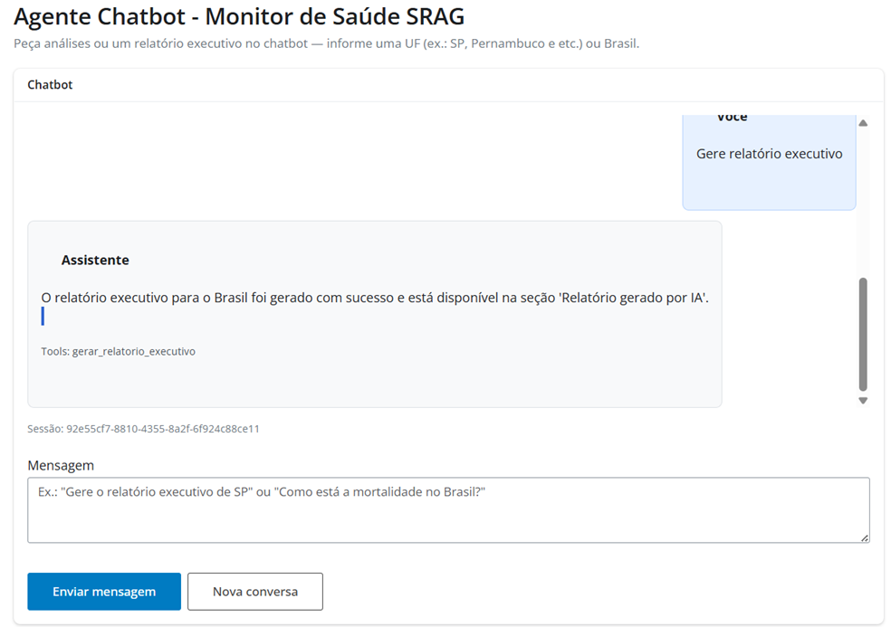
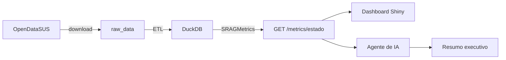

# SRAG Data Chatbot Health Agent Monitor

Solução para monitoramento de **SRAG** (Síndrome Respiratória Aguda Grave) com dados do [OpenDataSUS](https://opendatasus.saude.gov.br/). O projeto executa download e ETL dos datasets, persiste os dados em **DuckDB**, expõe **métricas de saúde** via **FastAPI**, disponibiliza um **dashboard web em [http://localhost:8080](http://localhost:8080)** e inclui um **agente de IA** que gera resumos executivos com dados oficiais e notícias (**Tavily Search**).



## Visão geral

Esta PoC foi desenhada para responder a uma pergunta prática: como transformar dados públicos de SRAG em uma interface analítica com métricas, séries temporais e um relatório automatizado por IA.

O sistema entrega quatro blocos principais:

- **Pipeline de dados**: baixa os CSVs do OpenDataSUS e prepara os dados para análise.
- **API de métricas**: expõe indicadores por UF ou para `BRASIL`.
- **Dashboard web**: frontend em Shiny para exploração visual e geração de relatório.
- **Agente orquestrador**: combina métricas oficiais, tendências e notícias via Tavily.

## O que o sistema faz

1. **Download** — Baixa quatro arquivos CSV de SRAG (2019 - 2026) a partir de URLs configuradas no `.env` e salva em `raw_data/`. Arquivos já presentes são reutilizados, sem novo download.
2. **ETL** — Faz merge dos CSVs, seleciona colunas relevantes, filtra registros inválidos, trata valores ausentes e deriva variáveis de período (`ANO_NOTIFIC`, `MES_NOTIFIC`).
3. **Persistência** — Grava o dataset tratado no DuckDB (`data/srag.duckdb`), na tabela `srag_notificacoes`.
4. **Pipeline** — Orquestra download + ETL em uma única chamada.
5. **Métricas** — Calcula taxa de aumento de casos, mortalidade, ocupação de UTI e vacinação COVID para cada UF ou para o Brasil (`BRASIL`).
6. **Dashboard** — Interface web em [Shiny for Python](https://shiny.posit.co/py/) disponível em **[http://localhost:8080](http://localhost:8080)** para visualizar as métricas de forma interativa.
7. **Agente de IA** — Gera resumo executivo com métricas oficiais, tendências e notícias recentes sobre SRAG.
8. **Chatbot / relatório LangGraph** — Orquestrador unico com tools dinâmicas, Tavily e gráficos oficiais (`ChartSpec`).

## Acesso rápido

- **Dashboard web:** [http://localhost:8080](http://localhost:8080)
- **API:** [http://localhost:8000](http://localhost:8000)
- **Swagger / OpenAPI:** [http://localhost:8000/docs](http://localhost:8000/docs)

O **dashboard em `http://localhost:8080` é a principal interface de uso do projeto**. Nele é possível selecionar o estado, visualizar métricas e gráficos e gerar o relatório executivo por IA.

## Endpoints principais

| Método | Caminho | Descrição |
|--------|---------|-----------|
| `GET` | `/health` | Health check da API |
| `POST` | `/datasets/download` | Download dos datasets |
| `POST` | `/datasets/etl` | Executa o ETL |
| `POST` | `/datasets/pipeline` | Download + ETL (fluxo completo) |
| `GET` | `/datasets/status` | Informa se os dados já estão prontos para consulta |
| `GET` | `/metrics/{estado}` | Retorna as 4 métricas SRAG para uma UF ou `BRASIL` |
| `GET` | `/metrics/{estado}/casos-diarios` | Retorna a série diária dos últimos 30 dias |
| `GET` | `/metrics/{estado}/casos-mensais` | Retorna a série mensal dos últimos 12 meses |
| `POST` | `/agents/report` | Gera resumo executivo com dados oficiais e notícias |
| `POST` | `/agents/chat` | Chatbot LangGraph (métricas, notícias, relatório) |
| `GET` | `/agents/audit` | Lista eventos de auditoria do orquestrador |
| `GET` | `/agents/audit/session/{session_id}` | Trilha de auditoria de uma sessão |
| `GET` | `/agents/audit/{audit_id}` | Detalhe de um evento de auditoria |
| `POST` | `/agents/chat` | Chatbot multi-turno (LangGraph) com charts e memória por sessão |

Documentação interativa (Swagger): [http://localhost:8000/docs](http://localhost:8000/docs)

### Exemplos de uso da API

```bash
# Todo o Brasil
curl http://localhost:8000/metrics/BRASIL

# Estado específico
curl http://localhost:8000/metrics/SP
```

## Arquitetura

O projeto segue o padrão **MVC**:

| Camada | Responsabilidade | Exemplos |
|--------|------------------|----------|
| **Views** (`app/views/`) | Rotas HTTP | `dataset_routes.py`, `metrics_routes.py`, `agent_routes.py` |
| **Controllers** (`app/controllers/`) | Orquestração | `pipeline_controller.py`, `metrics_controller.py`, `agent_controller.py` |
| **Services** (`app/services/`) | Regras de negócio | `etl_service.py`, `srag_metrics.py`, `srag_report_agent.py` |
| **Models** (`app/models/`) | Schemas Pydantic | `metrics.py`, `etl.py`, `agent.py` |



### Fluxo do agente

O agente usa a própria API do projeto como fonte oficial. Ao receber uma UF:

1. verifica `GET /datasets/status`
2. executa `POST /datasets/pipeline` se necessário
3. consulta métricas e séries temporais
4. busca notícias recentes via Tavily Search
5. envia o contexto consolidado para a OpenAI via LangChain
6. retorna um resumo executivo com até 4000 caracteres

Mais detalhes em [`docs/agente_orquestrador.md`](docs/agente_orquestrador.md).

## Executando com Docker

### Pré-requisitos

- [Docker](https://docs.docker.com/get-docker/) e Docker Compose instalados

### 1. Configurar variáveis de ambiente

```bash
cp .env.example .env
```

Ajuste o `.env` se necessário. Os valores padrão já funcionam para desenvolvimento local. Para o agente de IA, configure `OPENAI_API_KEY` e `TAVILY_API_KEY`.

> **Docker:** após alterar o `.env`, recrie os containers com `docker compose up -d --force-recreate`. O comando `docker compose restart` não recarrega variáveis de ambiente.

### 2. Subir a aplicação

```bash
docker compose up -d --build
```

### 3. Verificar se a API está no ar

```bash
curl http://localhost:8000/health
```

Resposta esperada: `{"status":"ok"}`

Documentação da API: [http://localhost:8000/docs](http://localhost:8000/docs)

### 4. Executar o pipeline de dados

```bash
curl -X POST http://localhost:8000/datasets/pipeline
```

Ou acesse a [documentação interativa da API](http://localhost:8000/docs) e execute `POST /datasets/pipeline` pela interface Swagger.

### 5. Abrir o dashboard

Com a API e o pipeline em execução, acesse o dashboard em:

**http://localhost:8080**

Esse é o endereço principal de uso do frontend. O dashboard permite:

- selecionar uma UF ou `BRASIL`
- visualizar as quatro métricas principais
- acompanhar gráficos de casos diários e mensais
- gerar um relatório executivo por IA no próprio frontend (botão **Gerar Relatório por IA**)

### 6. Consultar métricas via API

Após o pipeline, consulte as métricas:

```bash
curl http://localhost:8000/metrics/BRASIL
curl http://localhost:8000/metrics/SP
```

### 6.1 Gerar relatório executivo por IA

```bash
curl -X POST http://localhost:8000/agents/report \
  -H "Content-Type: application/json" \
  -d "{\"estado\":\"SP\"}"
```

### 7. Parar a aplicação

```bash
docker compose down
```

### Volumes

| Pasta local | Destino no container | Conteúdo |
|-------------|----------------------|----------|
| `./raw_data` | `/app/raw_data` | CSVs brutos do OpenDataSUS |
| `./data` | `/app/data` | Banco DuckDB (`srag.duckdb`) |

### Serviços Docker

| Serviço | Container | Porta | Descrição |
|---------|-----------|-------|-----------|
| `api` | `srag-api` | `8000` | API FastAPI |
| `dashboard` | `srag-dashboard` | `8080` | Dashboard Shiny |

### Logs

A aplicação usa o módulo **`logging`** do Python e envia registros para **stdout**. Com Docker, o driver **`json-file`** persiste esses logs nos arquivos internos do daemon (até ~50 MB por container: 5 arquivos × 10 MB).

Os logs incluem startup da API, requisições HTTP e eventos do pipeline (ETL, erros, avisos). O nível de verbosidade é controlado pela variável `LOG_LEVEL` no `.env` (padrão: `INFO`).

Para consultar os logs:

```bash
# API — todas as linhas
docker logs srag-api

# API — acompanhar em tempo real
docker logs -f srag-api

# API — últimas 50 linhas
docker logs srag-api --tail 50

# Dashboard
docker logs srag-dashboard
```

Exemplo de saída:

```
2026-07-02 19:15:05 | INFO     | app.main | API iniciada
2026-07-02 19:15:09 | INFO     | app.request | GET /health 200 4.40ms
2026-07-02 19:15:12 | ERROR    | app.services.etl_service | Nenhum arquivo CSV encontrado em /app/raw_data
```

## Executando localmente o dashboard

Com a API em execução na porta 8000:

```bash
pip install -r requirements.txt
shiny run shiny_app/dashboard.py --host 127.0.0.1 --port 8080
```

Abra em **[http://localhost:8080](http://localhost:8080)**.

Variável opcional: `API_BASE_URL` (padrão: `http://127.0.0.1:8000`).

## Testes

Na raiz do projeto:

```bash
pip install -r requirements.txt
pytest
```

A suíte está organizada em `tests/unit` e `tests/integration`, cobrindo:

- download dos datasets
- ETL e persistência no DuckDB
- cálculo das métricas SRAG
- rotas da API
- integração com Tavily
- integração com OpenAI
- agente orquestrador e endpoint `/agents/report`

## Documentação

- **API (Swagger UI):** [http://localhost:8000/docs](http://localhost:8000/docs)

Informações mais detalhadas estão na pasta [`docs/`](docs/):

| Documento | Conteúdo |
|-----------|----------|
| [`docs/arquitetura_solucao_srag.md`](docs/arquitetura_solucao_srag.md) | Diagrama conceitual da arquitetura da solução, incluindo frontend, backend, agente orquestrador, tools, LLM, banco de dados e fontes de notícias |
| [`docs/etl_pipeline.md`](docs/etl_pipeline.md) | Pipeline completo: download, ETL, arquitetura, configuração e exemplos |
| [`docs/metricas_srag.md`](docs/metricas_srag.md) | Cálculo das métricas SRAG, escopo por UF/Brasil, endpoint da API, fórmulas e cenários |
| [`docs/agente_orquestrador.md`](docs/agente_orquestrador.md) | Arquitetura do agente, tools LangChain, guardrails, fluxo do relatório e endpoint `/agents/report` |

## Stack

- **FastAPI** — API HTTP
- **httpx** — Download assíncrono dos datasets
- **pandas** — Transformação dos dados no ETL
- **DuckDB** — Armazenamento analítico
- **Shiny for Python** — Dashboard interativo de métricas
- **Plotly** — Gráficos no dashboard
- **LangChain** — Orquestração do agente e tools
- **OpenAI** — Geração do resumo executivo
- **Tavily Search** — Busca de notícias recentes sobre SRAG
- **Docker** — Containerização
