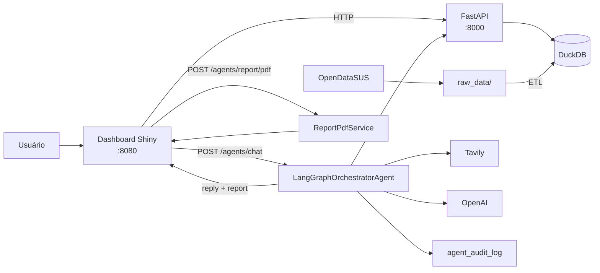
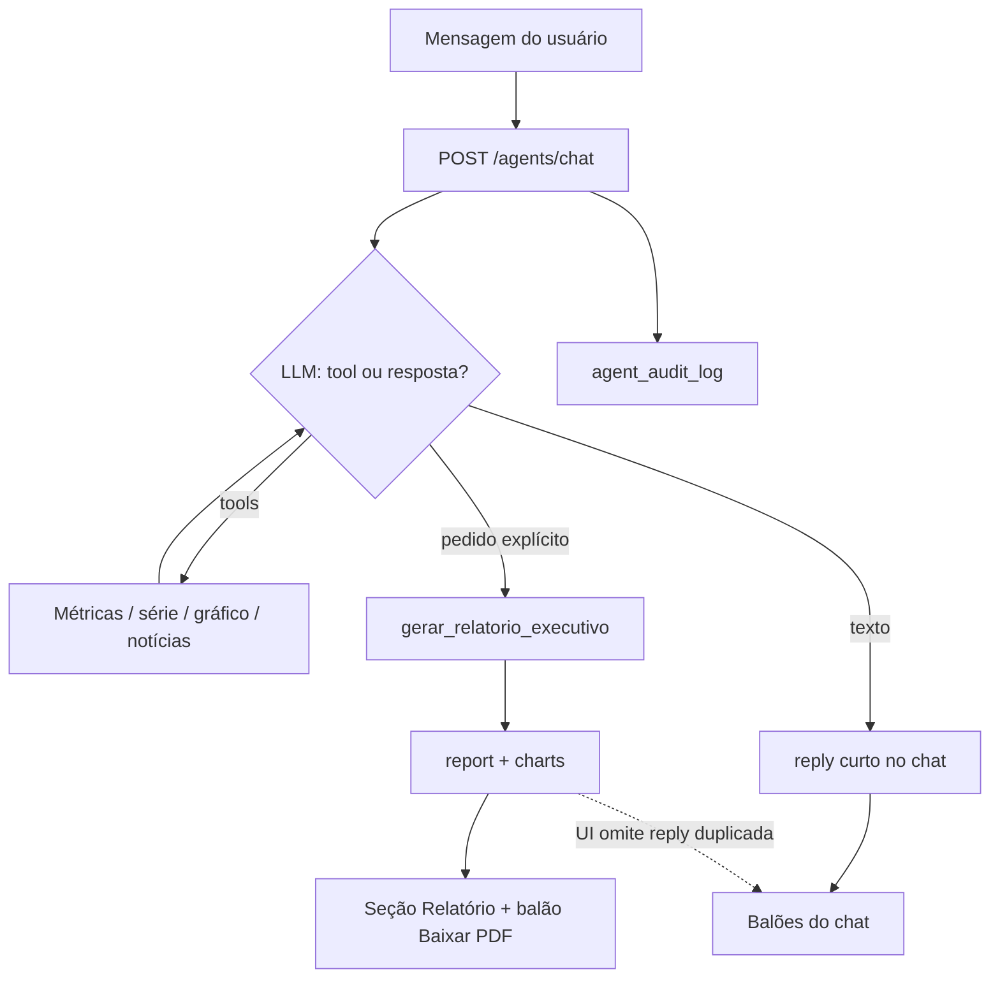

# Resumo da Arquitetura da Solução

Documento de visão rápida do **SRAG Data Health Agent Monitor**: o que o sistema faz (síntese do README), como a arquitetura se organiza e como o **agente orquestrador** funciona.

Para detalhes: [`README.md`](../README.md), [`arquitetura_solucao_srag.md`](arquitetura_solucao_srag.md), [`agente_orquestrador.md`](agente_orquestrador.md).

---

## Em uma frase

Dados públicos de SRAG (OpenDataSUS) → pipeline ETL → DuckDB → API FastAPI de métricas → dashboard Shiny com **chatbot** e **relatório por IA** (PDF), orquestrado por LangGraph com tools, Tavily e auditoria.

## Acesso

| Serviço | URL |
|---------|-----|
| Dashboard | [http://localhost:8080](http://localhost:8080) |
| API | [http://localhost:8000](http://localhost:8000) |
| Swagger | [http://localhost:8000/docs](http://localhost:8000/docs) |

---

## O que o sistema entrega

| Bloco | Função |
|-------|--------|
| **Pipeline** | Download dos CSVs OpenDataSUS + ETL → `data/srag.duckdb` (`srag_notificacoes`) |
| **Métricas** | Quatro indicadores + séries diária/mensal por UF ou `BRASIL` |
| **Dashboard** | Chatbot + seção **Relatório gerado por IA** + balão **Baixar PDF** |
| **Orquestrador** | LangGraph ReAct: escolhe tools (métricas, séries, gráficos, notícias, relatório) |
| **Auditoria** | Cada execução em `agent_audit_log` (consultável via API) |

### Fluxo de valor (resumo do README)

1. Baixa e prepara os CSVs SRAG (2019–2026).
2. Persiste no DuckDB e expõe métricas pela API.
3. O analista conversa no chatbot ou pede um relatório (UF / Brasil).
4. O orquestrador consulta dados oficiais e notícias, sintetiza o texto e devolve gráficos (`ChartSpec`).
5. O dashboard mostra o relatório completo; o PDF é gerado sob demanda (ReportLab), sem nova chamada à LLM.

---

## Arquitetura da solução

Padrão **MVC** na API:

| Camada | Papel |
|--------|--------|
| Views | Rotas HTTP (`dataset`, `metrics`, `agents`) |
| Controllers | Orquestração HTTP e erros |
| Services | ETL, métricas, LangGraph, PDF, auditoria |
| Models | Schemas Pydantic |

### Stack principal

FastAPI · DuckDB · Shiny · Plotly · LangGraph/LangChain · OpenAI · Tavily · ReportLab · Docker

### Endpoints que mais importam

| Endpoint | Uso |
|----------|-----|
| `POST /datasets/pipeline` | Prepara os dados |
| `GET /metrics/{estado}` | Métricas oficiais |
| `POST /agents/chat` | Chatbot (fluxo principal do dashboard) |
| `POST /agents/report` | Relatório one-shot via API |
| `POST /agents/report/pdf` | Exporta PDF do relatório já gerado |
| `GET /agents/audit` | Governança das execuções |

---

## Como o agente orquestrador funciona

Classe central: `LangGraphOrchestratorAgent` (`app/services/langgraph_orchestrator_agent.py`).

### Ideia central

O orquestrador **não** segue um roteiro fixo de ferramentas. Usa **ReAct** (`create_react_agent`): a LLM decide, a cada passo, se responde ou chama uma tool — e qual.

Características:

- Memória multi-turno (`MemorySaver` + `session_id`)
- Tools de métricas consomem a **API do projeto** (não o DuckDB direto)
- Relatório completo só em **pedido explícito** (`gerar_relatorio_executivo`)
- Temperatura padrão da LLM: `0`

### Tools

| Tool | Quando costuma ser usada |
|------|--------------------------|
| `consultar_metricas_srag` | Indicadores oficiais (4 métricas) |
| `consultar_serie_temporal` | Tendência diária ou mensal |
| `gerar_especificacao_grafico` | Monta `ChartSpec` para Plotly/PDF |
| `buscar_noticias_srag` | Contexto de mídia (Tavily + guardrails) |
| `gerar_relatorio_executivo` | Pedido explícito de relatório / resumo executivo |

### Fluxo no chatbot

1. Garante que o pipeline de dados está pronto.
2. Loop ReAct: escolhe e executa tools.
3. Responde no chat (escopo e período quando usa métricas).
4. Se pediu relatório: monta `report` e devolve para a UI; no dashboard, a confirmação no chat é só o balão **Baixar PDF**.
5. Grava auditoria e retorna `audit_id`.

### O que entra no relatório

| Parte | Origem |
|-------|--------|
| Narrativa em prosa | OpenAI |
| Tabela `## Quatro métricas principais` | API SRAG |
| Seção `## Notícias encontradas` (com links) | Tavily |
| `charts` (diário/mensal) | ChartSpecService |

Limite total do `resumo_executivo`: **5000** caracteres.

### PDF

`POST /agents/report/pdf` recebe `estado` + `resumo_executivo` + `charts` e gera o PDF com ReportLab (**sem** nova chamada à LLM). No dashboard, o balão **Baixar PDF** no chat usa esse endpoint.

### Guardrails (resumo)

- Escopo: SRAG / saúde respiratória no Brasil
- Números só via tools oficiais (não inventa)
- Relatório completo só sob pedido explícito
- Notícias filtradas (domínios e termos)

---

## Experiência no dashboard

1. Perguntas pontuais → resposta nos balões do chat.
2. “Gere o relatório de PE/RJ/Brasil…” → balão **Baixar PDF** no chat + texto/gráficos em **Relatório gerado por IA** (sem segundo balão de confirmação).
3. O balão de PDF atualiza se um novo relatório for gerado.
4. **Nova conversa** reinicia a sessão e limpa o relatório atual.

Nomes de tools do LangGraph **não** são exibidos na UI.

---

## Documentação complementar

| Documento | Conteúdo |
|-----------|----------|
| [`README.md`](../README.md) | Visão geral, execução Docker, endpoints |
| [`arquitetura_solucao_srag.md`](arquitetura_solucao_srag.md) | Arquitetura conceitual detalhada |
| [`agente_orquestrador.md`](agente_orquestrador.md) | Tools, guardrails, PDF, auditoria, testes |
| [`etl_pipeline.md`](etl_pipeline.md) | Download e ETL |
| [`metricas_srag.md`](metricas_srag.md) | Cálculo das métricas |
