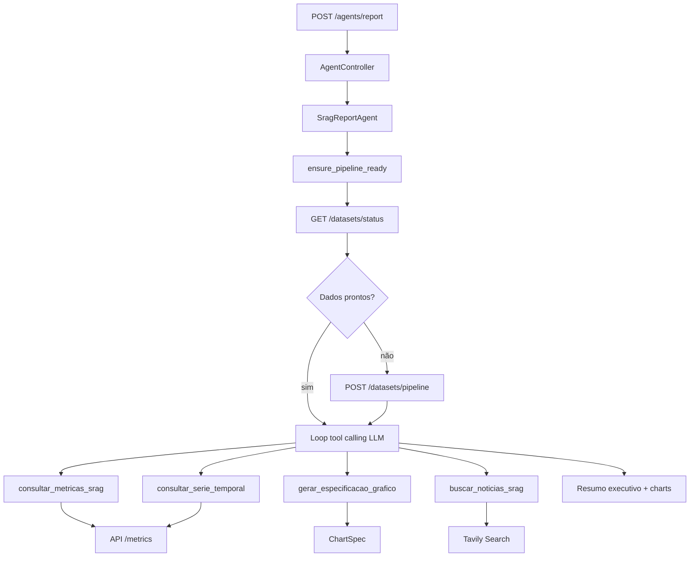

# Agente Orquestrador SRAG

## Objetivo

O agente orquestrador gera um **resumo executivo** sobre a situação de SRAG para uma UF ou para `BRASIL`, combinando:

- **dados oficiais** da API SRAG (métricas e séries temporais)
- **notícias recentes** buscadas via Tavily Search
- **síntese textual** produzida por um modelo da OpenAI via LangChain

O resultado é exposto pela API em `POST /agents/report` e também pode ser consumido no dashboard em **[http://localhost:8080](http://localhost:8080)**.

---

## Arquitetura

O fluxo segue o padrão MVC já adotado no projeto:

| Camada | Arquivo | Responsabilidade |
|--------|---------|------------------|
| Rota | `app/views/agent_routes.py` | Expõe `POST /agents/report` |
| Controller | `app/controllers/agent_controller.py` | Valida entrada e trata erros HTTP |
| Agente | `app/services/srag_report_agent.py` | Orquestra pipeline, tools e chamada à LLM |
| Modelos | `app/models/agent.py` | `ExecutiveSummaryRequest` e `ExecutiveSummaryResponse` |
| ChartSpec | `app/models/chart.py` + `app/services/chart_spec_service.py` | Contrato e montagem dos gráficos oficiais do relatório |

### Services envolvidos

| Classe | Arquivo | Responsabilidade |
|--------|---------|------------------|
| `OpenAILangChainService` | `app/services/openai_langchain_service.py` | Conecta à OpenAI via LangChain (`ChatOpenAI`) e executa loop de tool calling |
| `SragMetricsApiLangChainService` | `app/services/srag_metrics_api_service.py` | Cliente HTTP da API SRAG com exposição como tools LangChain |
| `ChartSpecService` | `app/services/chart_spec_service.py` | Monta ChartSpec e expõe tool `gerar_especificacao_grafico` |
| `TavilyNewsLangChainService` | `app/services/tavily_news_service.py` | Busca notícias recentes sobre SRAG no Brasil |
| `SragReportAgent` | `app/services/srag_report_agent.py` | Coordena tools via LLM e gera o resumo executivo final |

---

## Fluxo de execução

Quando `POST /agents/report` é chamado com um payload como:

```json
{
  "estado": "SP"
}
```

o agente executa a seguinte sequência:

1. chama `GET /datasets/status` via `ensure_pipeline_ready()`
2. se os dados não estiverem prontos, chama `POST /datasets/pipeline` automaticamente
3. inicia um **loop de tool calling** (`OpenAILangChainService.run_with_tools`): a LLM decide quais tools chamar e em qual ordem
4. tools disponíveis:
   - `consultar_metricas_srag`
   - `consultar_serie_temporal`
   - `gerar_especificacao_grafico`
   - `buscar_noticias_srag`
5. a LLM produz o texto final do resumo com base nos resultados das tools
6. retorna `resumo_executivo` (até **4000** caracteres) + `charts` (ChartSpec oficiais)
7. se a LLM não chamar `gerar_especificacao_grafico`, o agente faz fallback montando os charts a partir das séries oficiais

---

## Diagrama



---

## Tools LangChain

O agente utiliza tools estruturadas (`StructuredTool` do LangChain). A LLM escolhe dinamicamente quais chamar.

### `consultar_metricas_srag`

Definida em `SragMetricsApiLangChainService.as_tool()`.

| Propriedade | Valor |
|-------------|-------|
| Nome | `consultar_metricas_srag` |
| Entrada | `estado` (sigla da UF ou `BRASIL`) |
| Saída | JSON com métricas, casos diários e casos mensais |

O método `get_full_metrics_data()` agrega as três chamadas à API em um único payload:

```json
{
  "sg_uf_not": "SP",
  "metricas": {
    "taxa_aumento_casos": { "..." },
    "taxa_mortalidade": { "..." },
    "taxa_ocupacao_uti": { "..." },
    "taxa_vacinacao_populacao": { "..." }
  },
  "casos_diarios": { "..." },
  "casos_mensais": { "..." }
}
```

### `consultar_serie_temporal`

Definida em `SragMetricsApiLangChainService.as_series_tool()`.

| Propriedade | Valor |
|-------------|-------|
| Nome | `consultar_serie_temporal` |
| Entrada | `estado`, `serie` (`diaria` ou `mensal`) |
| Saída | JSON da série temporal oficial |

### `gerar_especificacao_grafico`

Definida em `ChartSpecService.as_tool(metrics_service)`.

| Propriedade | Valor |
|-------------|-------|
| Nome | `gerar_especificacao_grafico` |
| Entrada | `estado`, `serie` (`diaria` ou `mensal`) |
| Saída | JSON `ChartSpec` para renderização no dashboard |

### `buscar_noticias_srag`

Definida em `TavilyNewsLangChainService.as_tool()`.

| Propriedade | Valor |
|-------------|-------|
| Nome | `buscar_noticias_srag` |
| Entrada | vazia (consulta fixa otimizada) |
| Saída | Texto com manchetes, resumos e URLs |

Configuração da busca Tavily:

| Parâmetro | Valor |
|-----------|-------|
| `topic` | `news` |
| `search_depth` | `advanced` |
| `time_range` | `year` |
| `max_results` | `5` |
| `include_domains` | `gov.br`, `saude.gov.br`, `g1.globo.com`, `uol.com.br`, `cnnbrasil.com.br` |

---

## Formato do resumo

O prompt do agente instrui a LLM a produzir:

- panorama geral
- bloco **Dados oficiais**
- destaque para as **4 métricas**
- tendências dos casos diários e mensais
- bloco **Notícias**
- linguagem objetiva
- limite de **4000 caracteres**

As notícias são usadas apenas como **contexto complementar** e devem permanecer separadas dos dados oficiais.

Se não houver notícias relevantes, o agente deve informar isso explicitamente.

---

## Guardrails

### Dados oficiais

- a fonte oficial é a própria API SRAG
- se a pipeline não estiver pronta, o agente tenta executá-la automaticamente via `ensure_pipeline_ready()`
- o agente **não** consulta DuckDB diretamente; ele usa a API do projeto
- UF inválida retorna HTTP **422**

### Notícias

- o agente usa apenas **Tavily Search**
- a query padrão é restrita a notícias recentes sobre SRAG no Brasil
- resultados são filtrados para conter referência ao Brasil ou domínio `.br` e termos relacionados a SRAG/respiratório
- conteúdos com termos inadequados são bloqueados: `porn`, `sexo`, `violencia`, `racismo`, `politica`, `celebridade`, `guerra`, `crime`, `assassinato`, `terrorismo`
- notícias não substituem os números oficiais

### Resposta

- o texto final é truncado para no máximo 4000 caracteres, se necessário (corte em limite de palavra)
- o agente deve deixar clara a separação entre fatos medidos e contexto noticioso
- falhas na geração retornam HTTP **502**

---

## Endpoint

### Requisição

```bash
curl -X POST http://localhost:8000/agents/report \
  -H "Content-Type: application/json" \
  -d "{\"estado\":\"SP\"}"
```

### Resposta (`ExecutiveSummaryResponse`)

```json
{
  "estado": "SP",
  "resumo_executivo": "Resumo executivo em português...",
  "charts": [
    {
      "id": "casos_diarios",
      "type": "line",
      "title": "Casos diários de SRAG — SP",
      "x": {"field": "data", "label": "Data"},
      "y": {"field": "casos", "label": "Notificações"},
      "data": [{"data": "2026-06-01", "casos": 12}],
      "source": "GET /metrics/SP/casos-diarios",
      "caveat": "Períodos recentes podem estar incompletos por atraso de digitação/notificação; ..."
    },
    {
      "id": "casos_mensais",
      "type": "bar",
      "title": "Casos mensais de SRAG — SP",
      "x": {"field": "label", "label": "Mês"},
      "y": {"field": "casos", "label": "Notificações"},
      "data": [{"label": "05/2026", "casos": 100}],
      "source": "GET /metrics/SP/casos-mensais",
      "caveat": "Períodos recentes podem estar incompletos por atraso de digitação/notificação; ..."
    }
  ]
}
```

Os gráficos (`ChartSpec`) são montados por `ChartSpecService` a partir das séries oficiais da API. O prompt do agente orienta a não interpretar queda recente como redução real sem considerar atraso de notificação.
### Códigos de erro

| Código | Situação |
|--------|----------|
| `422` | UF inválida ou erro de validação |
| `502` | Falha na geração do resumo (OpenAI, Tavily, pipeline, etc.) |

---

## Chatbot LangGraph (`POST /agents/chat`)

Além do relatório one-shot, o projeto expõe um chatbot multi-turno orquestrado com **LangGraph** (`create_react_agent` + `MemorySaver`).

### Requisição

```bash
curl -X POST http://localhost:8000/agents/chat \
  -H "Content-Type: application/json" \
  -d "{\"message\":\"Mostre a tendencia mensal\",\"estado_contexto\":\"SP\",\"session_id\":\"sess-123\"}"
```

### Resposta (`ChatResponse`)

```json
{
  "session_id": "sess-123",
  "estado_contexto": "SP",
  "reply": "Resposta do assistente...",
  "charts": [],
  "tools_used": ["consultar_metricas_srag", "gerar_especificacao_grafico"]
}
```

| Campo | Descrição |
|-------|-----------|
| `session_id` | Memória da conversa (thread do LangGraph). Se omitido na request, a API cria um novo |
| `estado_contexto` | UF/`BRASIL` usado como contexto padrão das tools |
| `reply` | Texto da resposta |
| `charts` | ChartSpecs gerados nesta rodada |
| `tools_used` | Tools invocadas nesta rodada |

Arquivos principais: `app/services/srag_chat_agent.py`, `app/models/chat.py`.

---

## Variáveis de ambiente

O agente depende destas variáveis (definidas no `.env`):

| Variável | Descrição | Padrão |
|----------|-----------|--------|
| `OPENAI_API_KEY` | Chave da API OpenAI | — (obrigatória) |
| `OPENAI_MODEL` | Modelo utilizado | `gpt-4o-mini` |
| `OPENAI_TEMPERATURE` | Temperatura da LLM | `0` |
| `TAVILY_API_KEY` | Chave da API Tavily | — (obrigatória) |
| `API_BASE_URL` | URL base da API SRAG | `http://127.0.0.1:8000` |
| `HTTP_TIMEOUT_SECONDS` | Timeout das chamadas HTTP | `300` |
| `LOG_LEVEL` | Nível de logging | `INFO` |

No Docker, o serviço `dashboard` usa `API_BASE_URL=http://api:8000` para comunicação interna entre containers. Após alterar o `.env`, recrie os containers com `docker compose up -d --force-recreate` para que as novas variáveis sejam carregadas.

---

## Integração com o dashboard

O dashboard em **[http://localhost:8080](http://localhost:8080)** (`shiny_app/dashboard.py`) possui:

- filtro de estado (UF ou `BRASIL`)
- verificação automática do status do pipeline
- cards com as quatro métricas principais
- gráficos de casos diários e mensais (Plotly)
- botão **Gerar Relatório por IA**
- card textual para exibir o resumo do agente
- gráficos do relatório (diário e mensal) renderizados via Plotly a partir de `charts`
- **Chatbot SRAG (LangGraph)** com histórico, tools e gráficos da conversa
- botão **Nova conversa do chat**

Assim, o frontend apresenta métricas, gráficos e análise executiva em uma única interface.

---

## Testes

Os testes do agente e dos serviços relacionados estão em:

| Arquivo | Cobertura |
|---------|-----------|
| `tests/unit/test_srag_report_agent.py` | Orquestração do agente, charts e limite de 4000 caracteres |
| `tests/unit/test_srag_chat_agent.py` | Chatbot LangGraph (sessão, reply, charts, tools) |
| `tests/unit/test_agent_routes.py` | Endpoints `/agents/report` e `/agents/chat` |
| `tests/unit/test_chart_spec_service.py` | Montagem de ChartSpec a partir das séries oficiais |
| `tests/unit/test_srag_metrics_api_service.py` | Cliente HTTP, tool LangChain e `ensure_pipeline_ready` |
| `tests/unit/test_openai_langchain_service.py` | Integração com OpenAI via LangChain |
| `tests/unit/test_tavily_news_service.py` | Busca de notícias, filtros e tool LangChain |

Execução:

```bash
pytest tests/unit/test_srag_report_agent.py \
       tests/unit/test_agent_routes.py \
       tests/unit/test_srag_metrics_api_service.py \
       tests/unit/test_openai_langchain_service.py \
       tests/unit/test_tavily_news_service.py -v
```

Ou execute a suíte completa:

```bash
pytest
```
