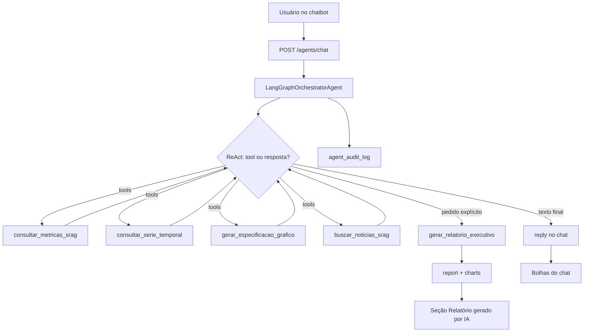

# Agente Orquestrador SRAG

## Objetivo

O orquestrador (`LangGraphOrchestratorAgent`) combina:

- **dados oficiais** da API SRAG (métricas e séries temporais)
- **notícias recentes** via Tavily Search
- **síntese textual** com OpenAI / LangChain
- **especificações de gráfico** (`ChartSpec`) para o dashboard Plotly
- **auditoria** de cada execução no DuckDB

No dashboard ([http://localhost:8080](http://localhost:8080)), o fluxo principal é o **chatbot**: o usuário pede análises ou um relatório citando UF/Brasil. O texto completo do relatório **não** vai para o chat — só para a seção **Relatório gerado por IA** (`ChatResponse.report`), com botão **Baixar PDF**.

A API também expõe `POST /agents/report` (relatório one-shot), `POST /agents/report/pdf` (exportação PDF do payload já gerado) e `POST /agents/chat` (multi-turno).

---

## Arquitetura

| Camada | Arquivo | Responsabilidade |
|--------|---------|------------------|
| Rota | `app/views/agent_routes.py` | `/agents/report`, `/agents/report/pdf`, `/agents/chat`, `/agents/audit*` |
| Controller | `app/controllers/agent_controller.py` | Validação HTTP e mapeamento de erros |
| Orquestrador | `app/services/langgraph_orchestrator_agent.py` | LangGraph (`create_react_agent` + `MemorySaver`) |
| Auditoria | `app/services/agent_audit_service.py` | Persistência/consulta de `agent_audit_log` |
| PDF | `app/services/report_pdf_service.py` | Exportação PDF do relatório (texto + gráficos) |
| Facades | `srag_report_agent.py`, `srag_chat_agent.py` | Compatibilidade (delegam ao orquestrador) |
| Modelos | `agent.py`, `chat.py`, `audit.py`, `chart.py` | Contratos Pydantic |

### Services

| Classe | Arquivo | Papel |
|--------|---------|-------|
| `LangGraphOrchestratorAgent` | `langgraph_orchestrator_agent.py` | Orquestrador único |
| `OpenAILangChainService` | `openai_langchain_service.py` | `ChatOpenAI` |
| `SragMetricsApiLangChainService` | `srag_metrics_api_service.py` | Tools de métricas/séries |
| `ChartSpecService` | `chart_spec_service.py` | Tool / montagem de ChartSpec |
| `TavilyNewsLangChainService` | `tavily_news_service.py` | Tool de notícias |
| `AgentAuditService` | `agent_audit_service.py` | Governança / trilha de auditoria |
| `ReportPdfService` | `report_pdf_service.py` | PDF do relatório executivo |

---

## Fluxo de execução

### Chat (`POST /agents/chat`) — fluxo principal do dashboard

1. Garante pipeline pronta (`ensure_pipeline_ready`)
2. Loop ReAct LangGraph: a LLM escolhe tools dinamicamente
3. Responde no chat (escopo + período quando usa métricas)
4. Se pediu relatório de forma **explícita**, chama `gerar_relatorio_executivo` e devolve `report` para a UI
5. Grava evento em `agent_audit_log` e retorna `audit_id`

### Relatório direto (`POST /agents/report`)

1. Pipeline pronta
2. Métricas + notícias + ChartSpec
3. LLM sintetiza resumo (até **5000** caracteres)
4. Auditoria + `audit_id`

### Exportação PDF (`POST /agents/report/pdf`)

Recebe o payload já gerado (`estado`, `resumo_executivo`, `charts`) e devolve `application/pdf` (sem nova chamada à LLM). No dashboard, o botão **Baixar PDF** usa este endpoint.



---

## Tools (tool calling dinâmico)

A LLM escolhe quais chamar e em qual ordem.

| Tool | Entrada | Saída |
|------|---------|-------|
| `consultar_metricas_srag` | `estado` | JSON com 4 métricas + séries |
| `consultar_serie_temporal` | `estado`, `serie` (`diaria`/`mensal`) | JSON da série |
| `gerar_especificacao_grafico` | `estado`, `serie` | `ChartSpec` JSON |
| `buscar_noticias_srag` | *(sem args)* | Manchetes/resumo/URLs |
| `gerar_relatorio_executivo` | `estado` | Confirmação; texto completo em `last_report` / `ChatResponse.report` |

### Tavily (`buscar_noticias_srag`)

| Parâmetro | Valor |
|-----------|-------|
| `topic` | `news` |
| `search_depth` | `advanced` |
| `time_range` | `year` |
| `max_results` | `5` |
| `include_domains` | `gov.br`, `saude.gov.br`, `g1.globo.com`, `uol.com.br`, `cnnbrasil.com.br` |

---

## Guardrails

### Chat / orquestrador (`SYSTEM_PROMPT`)

- Escopo SRAG / saúde respiratória no Brasil; recusa fora do tema
- Não inventa números; usa tools oficiais
- Informa escopo e período (`mes_anterior_*` → `mes_atual_*`)
- `gerar_relatorio_executivo` **somente** em pedido explícito de relatório/resumo executivo
- Não cola o relatório completo no chat
- Menciona atraso de notificação em quedas recentes da série

### Notícias

- Query fixa otimizada para SRAG no Brasil
- Filtro de Brasil/`.br` + termos respiratórios
- Bloqueio de termos inadequados (`porn`, `sexo`, `violencia`, `racismo`, `politica`, `celebridade`, `guerra`, `crime`, `assassinato`, `terrorismo`)

### Dados

- Fonte oficial = API do projeto (não DuckDB direto nas tools)
- UF inválida → HTTP **422**; falha de geração → **502**

---

## Endpoints

### Chat

```bash
curl -X POST http://localhost:8000/agents/chat \
  -H "Content-Type: application/json" \
  -d "{\"message\":\"Gere o relatório do Brasil\",\"session_id\":\"sess-123\"}"
```

`ChatResponse` (campos principais):

| Campo | Descrição |
|-------|-----------|
| `session_id` | Memória LangGraph (`MemorySaver`) |
| `estado_contexto` | UF/`BRASIL` associado à resposta |
| `reply` | Texto curto do chat |
| `tools_used` | Tools do **turno atual** |
| `charts` | ChartSpecs avulsos da rodada (não substitui o relatório) |
| `report` | Relatório completo + charts, se gerado |
| `audit_id` | Evento de auditoria |

### Relatório one-shot

```bash
curl -X POST http://localhost:8000/agents/report \
  -H "Content-Type: application/json" \
  -d "{\"estado\":\"SP\"}"
```

Retorna `estado`, `resumo_executivo`, `charts[]` (`ChartSpec`) e `audit_id`.

### Auditoria

```bash
curl "http://localhost:8000/agents/audit?limit=20"
curl "http://localhost:8000/agents/audit/session/{session_id}"
curl "http://localhost:8000/agents/audit/{audit_id}"
```

Tabela DuckDB `agent_audit_log` (mesmo arquivo de `DUCKDB_PATH`, separada de `srag_notificacoes`):

| Campo | Conteúdo |
|-------|----------|
| `audit_id`, `created_at`, `kind` | Id, timestamp UTC, `chat`/`report` |
| `session_id`, `estado_contexto` | Sessão e escopo |
| `user_message`, `reply` | Entrada/saída (truncadas) |
| `tools_used`, `tool_events` | Nomes + args/preview de resultados |
| `report_generated`, `charts_count`, `duration_ms` | Metadados da rodada |
| `status`, `error_message` | `ok` / `error` |

Falhas ao gravar auditoria **não** interrompem o agente.

---

## Variáveis de ambiente

| Variável | Descrição | Padrão |
|----------|-----------|--------|
| `OPENAI_API_KEY` | Chave OpenAI | — (obrigatória) |
| `OPENAI_MODEL` | Modelo | `gpt-4o-mini` |
| `OPENAI_TEMPERATURE` | Temperatura | `0` |
| `TAVILY_API_KEY` | Chave Tavily | — (obrigatória) |
| `API_BASE_URL` | Base da API SRAG | `http://127.0.0.1:8000` |
| `HTTP_TIMEOUT_SECONDS` | Timeout HTTP | `300` |
| `AGENT_AUDIT_ENABLED` | Liga auditoria | `true` |
| `AGENT_AUDIT_TABLE_NAME` | Tabela de auditoria | `agent_audit_log` |
| `LOG_LEVEL` | Logging | `INFO` |

No Docker, o dashboard usa `API_BASE_URL=http://api:8000`. Após mudar `.env`: `docker compose up -d --force-recreate`.

---

## Integração com o dashboard

Em [http://localhost:8080](http://localhost:8080) (`shiny_app/dashboard.py`):

- **Chatbot** no topo: perguntas pontuais ou pedido explícito de relatório
- **Relatório gerado por IA**: texto + gráficos SRAG diário/mensal (Plotly a partir de `ChartSpec`)
- Sem filtro lateral de UF nem botão “Gerar Relatório por IA”
- Escopo e período vêm nas respostas do agente
- Auto-scroll do log do chat para o final
- Botão **Nova conversa** (novo `session_id`)

---

## Testes

| Arquivo | Cobertura |
|---------|-----------|
| `tests/unit/test_srag_report_agent.py` | Relatório / limite 5000 chars / charts |
| `tests/unit/test_srag_chat_agent.py` | Chat, tools do turno, report, auditoria |
| `tests/unit/test_agent_routes.py` | `/agents/report`, `/chat`, `/audit` |
| `tests/unit/test_agent_audit_service.py` | Persistência DuckDB da auditoria |
| `tests/unit/test_chart_spec_service.py` | ChartSpec |
| `tests/unit/test_srag_metrics_api_service.py` | Cliente HTTP + tools |
| `tests/unit/test_openai_langchain_service.py` | OpenAI / LangChain |
| `tests/unit/test_tavily_news_service.py` | Notícias e guardrails |

```bash
pytest tests/unit/test_agent_audit_service.py \
       tests/unit/test_srag_chat_agent.py \
       tests/unit/test_agent_routes.py -v
```
