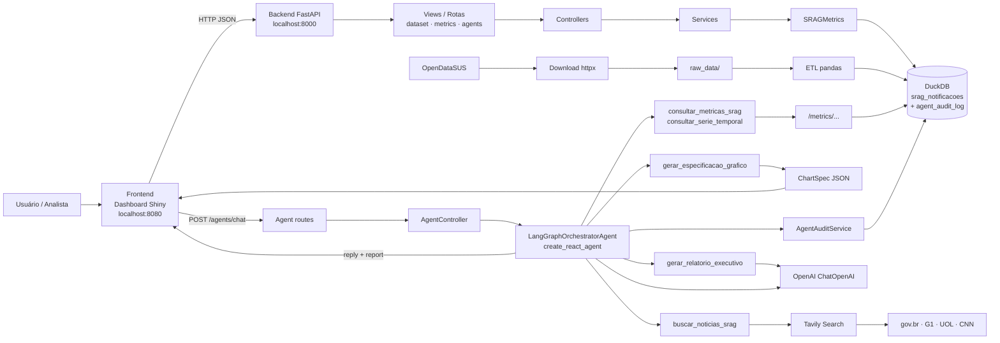
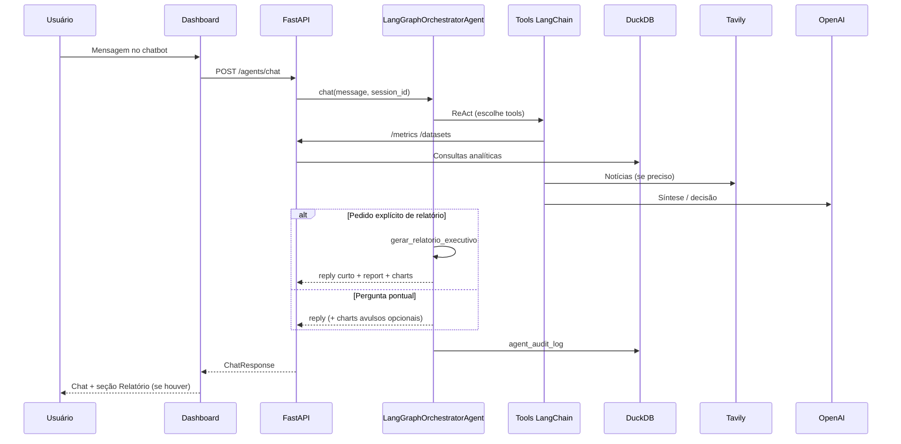

# Arquitetura Conceitual da Solução SRAG

Diagrama e componentes da solução **SRAG Data Health Agent Monitor**: frontend, backend, orquestrador LangGraph, tools, LLM, DuckDB, Tavily e auditoria.

## Visão Geral

A solução combina dados oficiais de SRAG (OpenDataSUS), DuckDB, API FastAPI, dashboard Shiny e um orquestrador LangGraph com chatbot, relatório executivo, gráficos oficiais (`ChartSpec`) e trilha de auditoria.

## Componentes principais

### Frontend

Dashboard **Shiny for Python** em `http://localhost:8080`:

- **Chatbot** — perguntas pontuais ou pedido explícito de relatório (informe UF ou Brasil)
- **Relatório gerado por IA** — texto completo + gráficos Plotly (não aparece no chat)
- Escopo e período analisado são informados pelo agente nas respostas
- Sem filtro lateral de UF e sem botão “Gerar Relatório por IA”

### Backend

**FastAPI** em `http://localhost:8000` (`/docs` para Swagger).

Rotas principais:

- `GET /health`
- `POST /datasets/download` · `POST /datasets/etl` · `POST /datasets/pipeline` · `GET /datasets/status`
- `GET /metrics/{estado}` · `/casos-diarios` · `/casos-mensais`
- `POST /agents/chat` · `POST /agents/report`
- `GET /agents/audit` · `/agents/audit/session/{session_id}` · `/agents/audit/{audit_id}`

### Camada de dados

1. Download dos CSVs OpenDataSUS → `raw_data/`
2. ETL (pandas) → limpeza e variáveis de período
3. DuckDB `data/srag.duckdb`:
   - `srag_notificacoes` — dados analíticos (ETL pode recriar a tabela)
   - `agent_audit_log` — auditoria do orquestrador (tabela separada)

## Orquestrador LangGraph

Classe: `LangGraphOrchestratorAgent` (`app/services/langgraph_orchestrator_agent.py`).

Facades de compatibilidade: `SragChatAgent`, `SragReportAgent`.

Características:

- **Tool calling dinâmico** (`create_react_agent`)
- Memória multi-turno (`MemorySaver` + `session_id`)
- Mesmas tools para chat e geração de relatório
- Não consulta DuckDB nas tools de métricas — usa a API do projeto
- Temperatura padrão da LLM: `0` (`OPENAI_TEMPERATURE`)

## Tools

| Tool | Função |
|------|--------|
| `consultar_metricas_srag` | 4 métricas + séries consolidadas |
| `consultar_serie_temporal` | Série diária ou mensal |
| `gerar_especificacao_grafico` | `ChartSpec` oficial (dados da API) |
| `buscar_noticias_srag` | Tavily + guardrails de conteúdo |
| `gerar_relatorio_executivo` | Relatório completo (só pedido explícito) |

O dashboard **renderiza** os `ChartSpec` com Plotly; o orquestrador não gera imagem.

## Fluxo do chatbot e do relatório

## Auditoria / governança

Cada execução grava: sessão, mensagem, reply, tools (args + preview), duração, status, se gerou relatório.

Consulta: `GET /agents/audit` (e variantes por sessão / `audit_id`).  
Detalhes: [`agente_orquestrador.md`](agente_orquestrador.md).

## Resultado esperado

No dashboard, o analista consegue:

- conversar sobre métricas, tendências e notícias de SRAG;
- pedir relatório executivo citando UF ou Brasil;
- ver gráficos oficiais no painel de relatório;
- rastrear execuções via API de auditoria.
