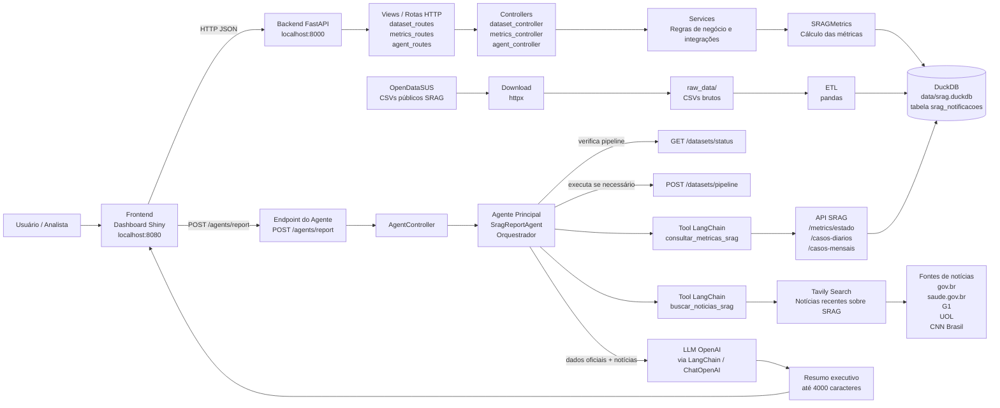
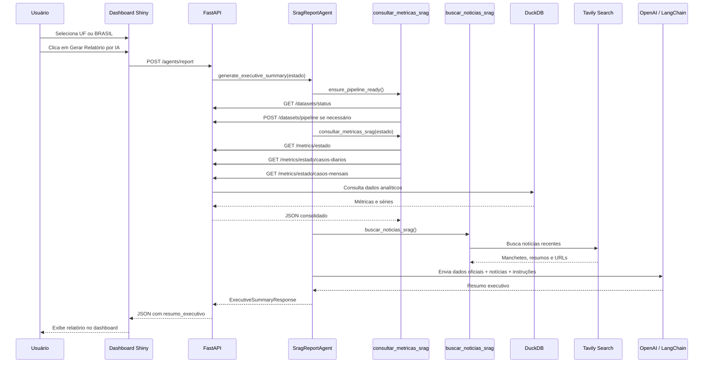

# Arquitetura Conceitual da Solução SRAG

Este documento apresenta o diagrama conceitual da solução **SRAG Data Health Agent Monitor**, cobrindo frontend, backend, agente principal orquestrador, tools, integração com LLM, banco de dados e fontes externas de notícias.

## Visão Geral

A solução combina dados oficiais de SRAG do OpenDataSUS, processamento analítico em DuckDB, uma API FastAPI, um dashboard Shiny e um agente de IA que gera resumo executivo com apoio de métricas oficiais e notícias recentes.

## Componentes Principais

### Frontend

O frontend é o dashboard em **Shiny for Python**, disponível em `http://localhost:8080`.

Ele permite selecionar uma UF ou `BRASIL`, visualizar cards de métricas, acompanhar gráficos de casos diários e mensais com Plotly e solicitar o relatório executivo por IA pelo botão **Gerar Relatório por IA**.

### Backend

O backend é uma API **FastAPI**. Documentação da API disponível em: `http://localhost:8000/docs`.

Ele expõe endpoints para saúde da aplicação, download dos datasets, execução da pipeline, consulta de métricas e geração do relatório por IA.

Principais rotas envolvidas:

- `GET /health`
- `POST /datasets/download`
- `POST /datasets/etl`
- `POST /datasets/pipeline`
- `GET /datasets/status`
- `GET /metrics/{estado}`
- `GET /metrics/{estado}/casos-diarios`
- `GET /metrics/{estado}/casos-mensais`
- `POST /agents/report`

### Camada de Dados

A camada de dados usa arquivos CSV públicos do **OpenDataSUS** como fonte oficial.

O fluxo de dados é:

1. Download dos CSVs para `raw_data/`.
2. ETL com `pandas`, incluindo merge, limpeza, filtros e derivação de variáveis de período.
3. Persistência no **DuckDB**, no arquivo `data/srag.duckdb`.
4. Consulta analítica pela API para cálculo das métricas SRAG.

## Agente Principal Orquestrador

O **Agente Principal** é implementado pelo serviço `SragReportAgent`.

Ele coordena a geração do resumo executivo a partir de três blocos de contexto:

- status da pipeline de dados;
- métricas e séries temporais oficiais vindas da própria API SRAG;
- notícias recentes sobre SRAG no Brasil.

O agente não consulta o DuckDB diretamente. Ele usa a API do próprio projeto como fonte oficial de dados.

## Tools Utilizadas

O `SragReportAgent` usa **tool calling dinâmico**: a LLM escolhe quais tools chamar e em qual ordem via `OpenAILangChainService.run_with_tools`.

### `consultar_metricas_srag`

Tool estruturada do LangChain definida por `SragMetricsApiLangChainService`.

Responsabilidades:

- consultar `GET /metrics/{estado}`;
- consultar `GET /metrics/{estado}/casos-diarios`;
- consultar `GET /metrics/{estado}/casos-mensais`;
- devolver um JSON consolidado com métricas e séries temporais.

A preparação da pipeline (`GET /datasets/status` e, se necessário, `POST /datasets/pipeline`) ocorre no agente antes do loop de tools.

As quatro métricas principais retornadas são:

- taxa de aumento de casos;
- taxa de mortalidade;
- taxa de ocupação de UTI;
- taxa de vacinação COVID na população analisada.

### `consultar_serie_temporal`

Consulta isolada de série `diaria` ou `mensal` para uma UF ou `BRASIL`.

### `gerar_especificacao_grafico`

Monta um `ChartSpec` oficial (linha diária ou barras mensais) a partir dos dados da API, para renderização no dashboard.

### `buscar_noticias_srag`

Tool estruturada do LangChain definida por `TavilyNewsLangChainService`.

Responsabilidades:

- buscar notícias recentes sobre SRAG no Brasil via **Tavily Search**;
- limitar a busca a notícias recentes, com `topic=news`, `search_depth=advanced`, `time_range=year` e `max_results=5`;
- priorizar fontes como `gov.br`, `saude.gov.br`, `g1.globo.com`, `uol.com.br` e `cnnbrasil.com.br`;
- aplicar guardrails para evitar conteúdos fora do tema, fora do Brasil ou inadequados;
- retornar manchetes, resumos e URLs relevantes.

## Interação com a LLM

A interação com a LLM é encapsulada pelo `OpenAILangChainService`, que usa `ChatOpenAI` via LangChain e um loop de tool calling (`bind_tools`).

O `SragReportAgent` instrui a LLM a:

- decidir dinamicamente quais tools usar;
- separar claramente **Dados oficiais** e **Notícias**;
- evitar interpretar queda recente como redução real sem considerar atraso de notificação;
- referenciar os gráficos oficiais quando gerados.

A LLM retorna um resumo executivo em português, objetivo, limitado a até 4000 caracteres.

## Fluxo do Relatório por IA

## Resultado Esperado

Ao final do fluxo, o usuário recebe no dashboard:

- métricas oficiais de SRAG para a UF ou para `BRASIL`;
- séries temporais de casos diários e mensais;
- notícias recentes usadas apenas como contexto complementar;
- resumo executivo gerado pela LLM, com separação clara entre dados oficiais e notícias.

