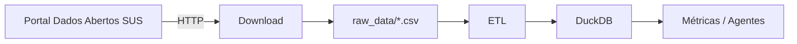
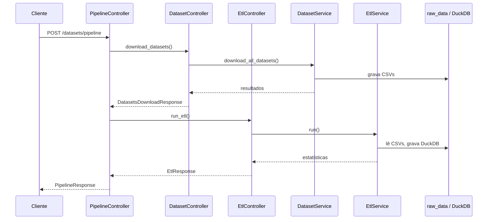
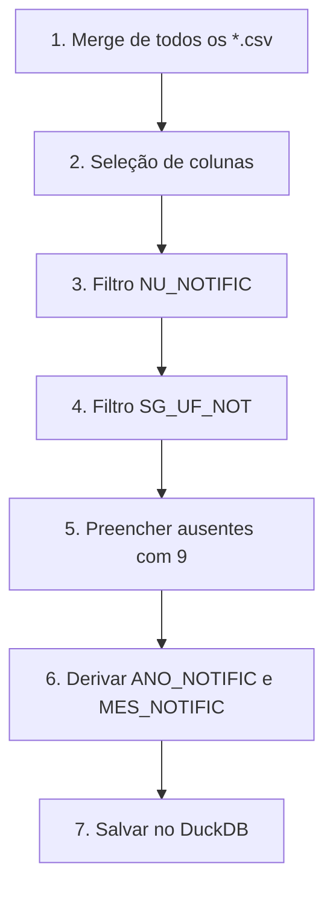

# Pipeline de Dados SRAG

Este documento descreve o processo de **pipeline** do projeto *SRAG Data Health Agent Monitor*: a orquestração que combina o **download** dos datasets do [Portal de Dados Abertos do SUS](https://dadosabertos.saude.gov.br/dataset/srag-2019-a-2026) com o **ETL** (Extract, Transform, Load) que prepara os dados para consulta no DuckDB.

---

## Fonte dos dados

Os dados sobre **SRAG** (Síndrome Respiratória Aguda Grave) utilizados neste projeto são obtidos diretamente do SUS, por meio do portal oficial:

**[Banco de dados da Síndrome Respiratória Aguda Grave (SRAG) — 2019 a 2026](https://dadosabertos.saude.gov.br/dataset/srag-2019-a-2026)**

Esse conjunto de dados reúne informações do **Sivep-Gripe** (Sistema de Informação da Vigilância Epidemiológica da Gripe), sistema oficial para registro de casos e óbitos por SRAG no Brasil. No portal estão disponíveis:

- Arquivos CSV organizados por **ano epidemiológico** (2019 a 2026)
- **Dicionário de dados** e ficha de notificação
- Bases de anos anteriores “congeladas” e banco **vivo** do ano corrente, atualizado semanalmente

As URLs configuradas no `.env` apontam para os arquivos CSV publicados nesse portal (armazenados no repositório S3 do DATASUS). O pipeline baixa esses arquivos automaticamente na etapa de download.

---

## Visão geral

O pipeline transforma dados brutos de SRAG, publicados em CSV no [Portal de Dados Abertos do SUS](https://dadosabertos.saude.gov.br/dataset/srag-2019-a-2026), em uma tabela analítica pronta para métricas e agentes de IA.



Existem três formas de executar esse fluxo:

| Endpoint | Descrição |
|----------|-----------|
| `POST /datasets/pipeline` | Fluxo completo (recomendado) |
| `POST /datasets/download/datasets` | Apenas download |
| `POST /datasets/etl` | Apenas ETL |

O endpoint de pipeline **não duplica lógica**: ele orquestra os controllers de download e ETL em sequência, mantendo cada etapa independente e testável.

---

## Arquitetura do pipeline



### Camadas envolvidas

| Camada | Arquivo | Papel |
|--------|---------|-------|
| Rota | `app/views/pipeline_routes.py` | Expõe `POST /datasets/pipeline` |
| Controller | `app/controllers/pipeline_controller.py` | Orquestra download → ETL |
| Serviço (download) | `app/services/dataset_service.py` | Baixa e persiste CSVs |
| Serviço (ETL) | `app/services/etl_service.py` | Transforma e grava no DuckDB |
| Configuração | `app/config.py` + `.env` | URLs, caminhos e colunas |

---

## Etapa 1 — Download dos datasets

### Objetivo

Obter os arquivos CSV de SRAG a partir das URLs configuradas no [Portal de Dados Abertos do SUS](https://dadosabertos.saude.gov.br/dataset/srag-2019-a-2026) e salvá-los localmente em `RAW_DATA_DIR` (padrão: `./raw_data`).

### Datasets configurados

Por padrão, o sistema baixa **dois arquivos**, definidos no `.env`:

| Variável | Exemplo |
|----------|---------|
| `DATASET_NAME_2019` | `INFLUD19-23-03-2026.csv` |
| `DATASET_URL_2019` | URL do CSV de 2019 no portal SUS |
| `DATASET_NAME_2025` | `INFLUD25-29-06-2026.csv` |
| `DATASET_URL_2025` | URL do CSV de 2025 no portal SUS |

### Como funciona

1. Garante que a pasta `raw_data` existe.
2. Para cada dataset configurado, verifica se o arquivo **já existe e não está vazio**.
3. Se o arquivo já existir → **ignora o download** (`skipped: true`).
4. Se não existir (ou estiver vazio) → faz requisição HTTP com `httpx.AsyncClient`.
5. Salva o conteúdo no disco com o nome definido em `DATASET_NAME_*`.

### Parâmetros relevantes

| Variável | Descrição | Padrão |
|----------|-----------|--------|
| `HTTP_TIMEOUT_SECONDS` | Tempo máximo de espera por download | `300` (5 min) |
| `RAW_DATA_DIR` | Pasta de destino dos CSVs | `./raw_data` |

### Comportamento em falhas

- **Falha em um dataset**: retorna `success: false` para aquele arquivo, mas continua os demais.
- **Falha em todos os datasets**: retorna HTTP `502` e o pipeline **interrompe** (ETL não é executado).
- **Falha parcial**: download retorna sucesso parcial; o ETL roda com os arquivos disponíveis em `raw_data`.

### Exemplo de resposta (download)

```json
{
  "message": "Download concluído; alguns datasets já estavam presentes.",
  "total": 2,
  "successful": 2,
  "failed": 0,
  "datasets": [
    {
      "name": "INFLUD19-23-03-2026.csv",
      "url": "https://s3.sa-east-1.amazonaws.com/...",
      "path": "./raw_data/INFLUD19-23-03-2026.csv",
      "size_bytes": 52428800,
      "success": true,
      "skipped": true,
      "error": null
    }
  ]
}
```

---

## Etapa 2 — ETL (Extract, Transform, Load)

### Objetivo

Ler todos os CSVs em `raw_data`, aplicar regras de limpeza e tratamento, e persistir o resultado na tabela DuckDB configurada.

### Passos do ETL



#### 1. Merge

Concatena **todos** os arquivos `*.csv` presentes em `raw_data`, não apenas os configurados no `.env`. Isso permite incluir datasets adicionais manualmente, se necessário.

#### 2. Seleção de colunas

Mantém apenas:

| Coluna | Descrição |
|--------|-----------|
| `NU_NOTIFIC` | Número da notificação (identificador do caso) |
| `DT_NOTIFIC` | Data da notificação |
| `SG_UF_NOT` | UF de notificação |
| `CLASSI_FIN` | Classificação final |
| `EVOLUCAO` | Evolução do caso |
| `UTI` | Internação em UTI |
| `VACINA_COV` | Vacina COVID-19 |
| `VACINA` | Vacina contra influenza |

#### 3 e 4. Filtros

Remove linhas que **não possuem informação** em:

- `NU_NOTIFIC` (vazio ou nulo)
- `SG_UF_NOT` (vazio ou nulo)

#### 5. Tratamento de valores ausentes

Nas colunas `CLASSI_FIN`, `EVOLUCAO`, `UTI`, `VACINA_COV` e `VACINA`, valores vazios ou nulos são preenchidos com **`9`**, código padrão de “ignorado/não informado” nos dados do DATASUS.

#### 6. Derivação de período

A partir de `DT_NOTIFIC`, cria:

- `ANO_NOTIFIC` — ano da notificação
- `MES_NOTIFIC` — mês da notificação

> **Nota:** `NU_NOTIFIC` é um identificador numérico do caso, não uma data. Por isso ano e mês são derivados de `DT_NOTIFIC`.

#### 7. Persistência no DuckDB

O dataset tratado é salvo com:

```sql
CREATE OR REPLACE TABLE "srag_notificacoes" AS SELECT * FROM etl_frame
```

A tabela é **recriada** a cada execução do ETL.

### Configuração do DuckDB

| Variável | Descrição | Padrão |
|----------|-----------|--------|
| `DUCKDB_PATH` | Caminho do arquivo do banco | `./data/srag.duckdb` |
| `ETL_TABLE_NAME` | Nome da tabela | `srag_notificacoes` |

No Docker, os volumes mapeiam:

- `./raw_data` → `/app/raw_data`
- `./data` → `/app/data`

### Schema final (10 colunas)

```
NU_NOTIFIC, DT_NOTIFIC, SG_UF_NOT, CLASSI_FIN, EVOLUCAO,
UTI, VACINA_COV, VACINA, ANO_NOTIFIC, MES_NOTIFIC
```

### Exemplo de resposta (ETL)

```json
{
  "message": "ETL concluído com sucesso.",
  "files_merged": [
    "INFLUD19-23-03-2026.csv",
    "INFLUD25-29-06-2026.csv"
  ],
  "rows_before_filter": 385213,
  "rows_after_filter": 385167,
  "rows_saved": 385167,
  "table_name": "srag_notificacoes",
  "database_path": "./data/srag.duckdb"
}
```

---

## Resposta do pipeline completo

O endpoint `POST /datasets/pipeline` retorna um objeto unificado com o resultado das duas etapas:

```json
{
  "message": "Pipeline concluído: download e ETL executados com sucesso.",
  "download": { "...": "..." },
  "etl": { "...": "..." }
}
```

### Mensagens possíveis

| Situação | Mensagem |
|----------|----------|
| Download e ETL OK | *Pipeline concluído: download e ETL executados com sucesso.* |
| Arquivos já existiam | *Pipeline concluído: datasets já presentes e ETL executado com sucesso.* |
| Falha parcial no download | *Pipeline concluído com falhas parciais no download; ETL executado com os arquivos disponíveis.* |

---

## Como executar

### Via API (Swagger)

1. Inicie a aplicação (`docker compose up` ou `uvicorn app.main:app`).
2. Acesse `http://localhost:8000/docs`.
3. Execute `POST /datasets/pipeline`.

### Via curl

```bash
curl -X POST http://localhost:8000/datasets/pipeline
```

### Fluxo manual (etapas separadas)

```bash
# Apenas download
curl -X POST http://localhost:8000/datasets/download/datasets

# Apenas ETL (requer CSVs em raw_data)
curl -X POST http://localhost:8000/datasets/etl
```

---

## Testes automatizados

O projeto inclui testes unitários para download e ETL em `tests/`:

```bash
pytest tests/ -v
```

Os testes de download usam `httpx.MockTransport` (sem internet). Os testes de ETL usam CSVs pequenos de fixture e banco DuckDB temporário.

---

## Diagrama de pastas após o pipeline

```
srag-data-health-agent-monitor/
├── raw_data/
│   ├── INFLUD19-23-03-2026.csv    ← download
│   └── INFLUD25-29-06-2026.csv    ← download
└── data/
    └── srag.duckdb                ← ETL (tabela srag_notificacoes)
```

---

## Próximos passos

Com os dados no DuckDB, a aplicação está pronta para:

- Consultas SQL para métricas (mortalidade, UTI, vacinação, etc.)
- Integração com agentes de IA via tools
- Geração de relatórios e gráficos

O pipeline é a **base de dados** sobre a qual o restante da solução será construído.
