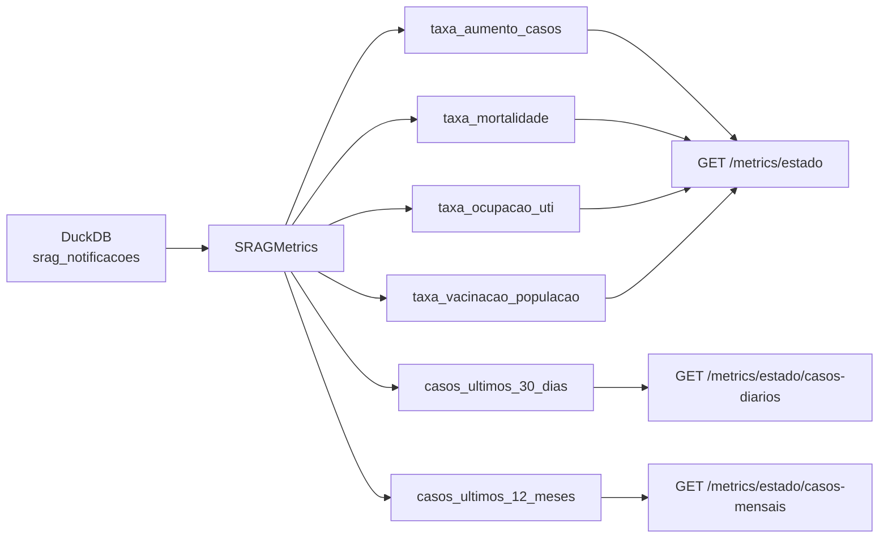
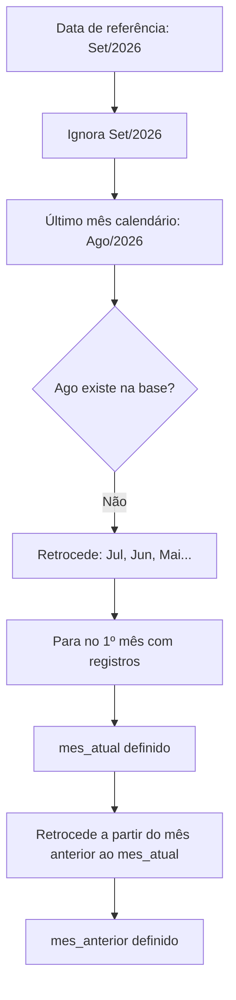

# Métricas SRAG

Este documento descreve o cálculo das métricas implementadas na classe `SRAGMetrics` (`app/services/srag_metrics.py`), incluindo regras de período, filtros, escopo geográfico, fórmulas, endpoints da API, séries temporais e cenários especiais.

Os dados utilizados vêm da tabela DuckDB `srag_notificacoes`, gerada pelo processo de ETL documentado em [`etl_pipeline.md`](etl_pipeline.md).

---

## Visão geral



| Métrica | Método | Pergunta que responde |
|---------|--------|------------------------|
| Taxa de aumento de casos | `taxa_aumento_casos()` | Os casos aumentaram ou caíram entre os dois últimos meses com dados? |
| Taxa de mortalidade | `taxa_mortalidade()` | Qual a letalidade entre os casos notificados no período? |
| Taxa de ocupação de UTI | `taxa_ocupacao_uti()` | Qual percentual de casos precisou de UTI no período? |
| Taxa de vacinação da população | `taxa_vacinacao_populacao()` | Qual percentual de casos estava vacinado contra COVID no período? |
| Casos diários | `casos_ultimos_30_dias()` | Como evoluíram os casos dia a dia nos últimos 30 dias? |
| Casos mensais | `casos_ultimos_12_meses()` | Como evoluíram os casos mês a mês nos últimos 12 meses? |

---

## Endpoints da API

### Métricas agregadas

| Método | Caminho | Descrição |
|--------|---------|-----------|
| `GET` | `/metrics/{estado}` | Retorna as 4 métricas para uma UF ou para o Brasil |

### Séries temporais

| Método | Caminho | Descrição |
|--------|---------|-----------|
| `GET` | `/metrics/{estado}/casos-diarios` | Contagem diária dos últimos 30 dias |
| `GET` | `/metrics/{estado}/casos-mensais` | Contagem mensal dos últimos 12 meses |

### Parâmetro `estado`

| Valor | Escopo | Campo `sg_uf_not` na resposta |
|-------|--------|-------------------------------|
| `BRASIL` | Todo o país | `"BRASIL"` |
| Sigla da UF | Estado específico | `"SP"`, `"RJ"`, etc. |

**UFs aceitas:** `AC`, `AL`, `AM`, `AP`, `BA`, `CE`, `DF`, `ES`, `GO`, `MA`, `MG`, `MS`, `MT`, `PA`, `PB`, `PE`, `PI`, `PR`, `RJ`, `RN`, `RO`, `RR`, `RS`, `SC`, `SE`, `SP`, `TO`

A sigla é normalizada para maiúsculas. UF inválida retorna HTTP **422**.

### Exemplos

```bash
curl http://localhost:8000/metrics/BRASIL
curl http://localhost:8000/metrics/SP
curl http://localhost:8000/metrics/rj
curl http://localhost:8000/metrics/SP/casos-diarios
curl http://localhost:8000/metrics/SP/casos-mensais
```

### Resposta (`SRAGMetricsResponse`)

```json
{
  "sg_uf_not": "SP",
  "taxa_aumento_casos": {
    "sg_uf_not": "SP",
    "mes_atual_ano": 2026,
    "mes_atual_mes": 6,
    "mes_anterior_ano": 2026,
    "mes_anterior_mes": 5,
    "casos_mes_atual": 4,
    "casos_mes_anterior": 2,
    "taxa_aumento_percentual": 100.0
  },
  "taxa_mortalidade": {
    "sg_uf_not": "SP",
    "mes_atual_ano": 2026,
    "mes_atual_mes": 6,
    "mes_anterior_ano": 2026,
    "mes_anterior_mes": 5,
    "total_casos_2_meses": 7,
    "total_obitos_2_meses": 3,
    "taxa_mortalidade_percentual": 42.86
  },
  "taxa_ocupacao_uti": { "..." : "..." },
  "taxa_vacinacao_populacao": { "..." : "..." }
}
```

### Arquitetura dos endpoints

| Camada | Arquivo |
|--------|---------|
| Rota | `app/views/metrics_routes.py` |
| Controller | `app/controllers/metrics_controller.py` |
| Serviço | `app/services/srag_metrics.py` |
| Modelos | `app/models/metrics.py` (`SRAGMetricsResponse`, `DailyCasesSeriesResponse`, `MonthlyCasesSeriesResponse`) |

### Dashboard Shiny

As métricas e séries temporais podem ser visualizadas no dashboard interativo em `shiny_app/dashboard.py` ([Shiny for Python](https://shiny.posit.co/py/)):

- **Docker:** [http://localhost:8080](http://localhost:8080) (serviço `dashboard`)
- **Local:** `shiny run shiny_app/dashboard.py --host 127.0.0.1 --port 8080`

O dashboard consome a API (`API_BASE_URL`) e exibe cards de métricas, permite gerar relatório executivo por IA e conversar com o chatbot (gráficos via ChartSpec no relatório/chat).

---

## Escopo geográfico

Todas as métricas e séries aceitam o parâmetro opcional `estado` no serviço `SRAGMetrics`:

```python
from app.services.srag_metrics import SRAGMetrics

metrics = SRAGMetrics()

# Todo o Brasil
metrics.taxa_mortalidade(estado="BRASIL")

# Estado específico
metrics.taxa_mortalidade(estado="SP")
```

### Comportamento por escopo

- **`BRASIL`**: agrega dados de todas as UFs; não aplica filtro em `SG_UF_NOT`.
- **UF**: filtra registros com `SG_UF_NOT = ?` em todas as queries.
- **Resolução de meses independente**: cada escopo usa seus próprios meses com dados disponíveis. Um estado sem registros em determinado mês retrocede conforme a regra geral, sem afetar o cálculo nacional.

### Métodos em lote

Para calcular todas as métricas de uma vez para o Brasil e as 27 UFs (28 resultados cada):

```python
metrics.taxa_aumento_casos_brasil_e_estados()
metrics.taxa_mortalidade_brasil_e_estados()
metrics.taxa_ocupacao_uti_brasil_e_estados()
metrics.taxa_vacinacao_populacao_brasil_e_estados()
```

Cada lista retorna primeiro o escopo nacional (`sg_uf_not = "BRASIL"`), seguido das UFs na ordem definida em `SRAG_STATE_CODES`.

---

## Regra comum: seleção de meses

Todas as **métricas agregadas** compartilham a mesma lógica para definir **quais meses** entram no cálculo.

### 1. Ignorar o mês corrente

O mês da **data de referência** (padrão: hoje) é considerado **incompleto** e nunca entra no cálculo.

Exemplo: referência em **15/09/2026** → setembro/2026 é ignorado.

### 2. Retroceder quando o mês não existe na base

Se o mês calendário esperado **não tiver registros** no DuckDB para o escopo consultado, o sistema retrocede mês a mês até encontrar o **mês completo anterior mais recente com dados**.



### 3. Dois papéis de mês

| Variável | Significado |
|----------|-------------|
| `mes_atual` | Último mês completo com dados (mais recente) |
| `mes_anterior` | Mês completo com dados imediatamente anterior ao `mes_atual` |

### Exemplo prático

Referência: **setembro/2026**. Base contém dados apenas em **mai/2026** e **jun/2026** (meses 7, 8 e 9 ausentes).

| Tentativa | Mês | Na base? |
|-----------|-----|----------|
| Ignorado | Set/2026 | — |
| Calendário | Ago/2026 | Não → retrocede |
| Calendário | Jul/2026 | Não → retrocede |
| Calendário | Jun/2026 | Sim → **mes_atual** |
| Anterior | Mai/2026 | Sim → **mes_anterior** |

Se **jun/2026** também não existisse, `mes_atual` seria **mai/2026**.

### Uso no código

```python
from datetime import date

from app.services.srag_metrics import SRAGMetrics

metrics = SRAGMetrics()

# Usa a data de hoje como referência
metrics.taxa_mortalidade(estado="BRASIL")

# Data específica e UF (útil para testes)
metrics.taxa_mortalidade(reference_date=date(2026, 9, 15), estado="SP")
```

---

## Constantes de configuração

Definidas em `app/config.py`:

| Constante | Valor | Uso |
|-----------|-------|-----|
| `SRAG_VALID_CLASSI_FIN` | 1, 2, 3, 4 | Filtro da taxa de aumento de casos e das séries temporais |
| `SRAG_EVOLUCAO_OBITO` | 2 | Indica óbito |
| `SRAG_UTI_INTERNADO` | 1 | Indica internação em UTI |
| `SRAG_VACINA_COV_VACINADO` | 1 | Indica vacinação COVID |
| `SRAG_BRASIL_CODE` | `BRASIL` | Identificador do escopo nacional |
| `SRAG_STATE_CODES` | 27 UFs | Siglas válidas para filtro por estado |

Colunas derivadas pelo ETL usadas nos filtros temporais: `ANO_NOTIFIC` e `MES_NOTIFIC` (a partir de `DT_NOTIFIC`).

---

## 1. Taxa de aumento de casos

**Método:** `taxa_aumento_casos(estado=None)`

### Objetivo

Medir a **variação percentual** de casos entre os dois últimos meses completos com dados.

### Filtro adicional

Considera apenas registros com **`CLASSI_FIN` ∈ {1, 2, 3, 4}** (classificações válidas). Valores como `9` (ignorado) são excluídos.

### Fórmula

```
taxa_aumento_percentual = ((casos_mes_atual - casos_mes_anterior) / casos_mes_anterior) × 100
```

Onde:

- `casos_mes_atual` = total de casos válidos em `mes_atual`
- `casos_mes_anterior` = total de casos válidos em `mes_anterior`

### Interpretação

| Resultado | Significado |
|-----------|-------------|
| Valor **positivo** | Aumento de casos |
| Valor **negativo** | Queda de casos |
| **`None`** | `casos_mes_anterior = 0` (divisão impossível) |

### Exemplo

Referência: julho/2026. Meses resolvidos: **jun/2026** (4 casos) e **mai/2026** (2 casos).

```
taxa = ((4 - 2) / 2) × 100 = 100%
```

### Retorno (`CaseIncreaseRateMetric`)

```json
{
  "sg_uf_not": "BRASIL",
  "mes_atual_ano": 2026,
  "mes_atual_mes": 6,
  "mes_anterior_ano": 2026,
  "mes_anterior_mes": 5,
  "casos_mes_atual": 4,
  "casos_mes_anterior": 2,
  "taxa_aumento_percentual": 100.0
}
```

---

## 2. Taxa de mortalidade

**Método:** `taxa_mortalidade(estado=None)`

### Objetivo

Calcular a **letalidade** entre os casos SRAG notificados nos dois últimos meses completos com dados.

### Critério de óbito

**`EVOLUCAO = 2`**

### Fórmula

```
taxa_mortalidade_percentual = (total_obitos_2_meses / total_casos_2_meses) × 100
```

Onde:

- `total_casos_2_meses` = todos os casos em `mes_atual` + `mes_anterior`
- `total_obitos_2_meses` = casos com `EVOLUCAO = 2` nesses dois meses

> Não há filtro de `CLASSI_FIN` nesta métrica.

### Interpretação

| Resultado | Significado |
|-----------|-------------|
| **0%** | Nenhum óbito no período |
| **> 0%** | Percentual de casos que evoluíram para óbito |
| **`None`** | `total_casos_2_meses = 0` |

### Exemplo

900 casos no período, 27 óbitos:

```
taxa = (27 / 900) × 100 = 3%
```

### Retorno (`MortalityRateMetric`)

```json
{
  "sg_uf_not": "SP",
  "mes_atual_ano": 2026,
  "mes_atual_mes": 6,
  "mes_anterior_ano": 2026,
  "mes_anterior_mes": 5,
  "total_casos_2_meses": 900,
  "total_obitos_2_meses": 27,
  "taxa_mortalidade_percentual": 3.0
}
```

---

## 3. Taxa de ocupação de UTI

**Método:** `taxa_ocupacao_uti(estado=None)`

### Objetivo

Calcular o **percentual de casos** que necessitaram internação em UTI nos dois últimos meses completos com dados.

### Critério de UTI

**`UTI = 1`**

### Fórmula

```
taxa_ocupacao_uti_percentual = (casos_com_uti_2_meses / total_casos_2_meses) × 100
```

Onde:

- `total_casos_2_meses` = todos os casos em `mes_atual` + `mes_anterior`
- `casos_com_uti_2_meses` = casos com `UTI = 1` nesses dois meses

### Interpretação

| Resultado | Significado |
|-----------|-------------|
| **0%** | Nenhum caso com UTI no período |
| **> 0%** | Percentual de casos que foram para UTI |
| **`None`** | `total_casos_2_meses = 0` |

### Exemplo

900 casos no período, 72 com UTI:

```
taxa = (72 / 900) × 100 = 8%
```

### Retorno (`UtiOccupancyRateMetric`)

```json
{
  "sg_uf_not": "RJ",
  "mes_atual_ano": 2026,
  "mes_atual_mes": 6,
  "mes_anterior_ano": 2026,
  "mes_anterior_mes": 5,
  "total_casos_2_meses": 900,
  "casos_com_uti_2_meses": 72,
  "taxa_ocupacao_uti_percentual": 8.0
}
```

---

## 4. Taxa de vacinação da população

**Método:** `taxa_vacinacao_populacao(estado=None)`

### Objetivo

Calcular o **percentual de casos** vacinados contra COVID-19 nos dois últimos meses completos com dados.

### Critério de vacinação

**`VACINA_COV = 1`**

### Fórmula

```
taxa_vacinacao_percentual = (casos_vacinados_2_meses / total_casos_2_meses) × 100
```

Onde:

- `total_casos_2_meses` = todos os casos em `mes_atual` + `mes_anterior`
- `casos_vacinados_2_meses` = casos com `VACINA_COV = 1` nesses dois meses

### Interpretação

| Resultado | Significado |
|-----------|-------------|
| **0%** | Nenhum caso vacinado no período |
| **> 0%** | Percentual de casos vacinados |
| **`None`** | `total_casos_2_meses = 0` |

### Exemplo

900 casos no período, 540 vacinados:

```
taxa = (540 / 900) × 100 = 60%
```

### Retorno (`CovidVaccinationRateMetric`)

```json
{
  "sg_uf_not": "MG",
  "mes_atual_ano": 2026,
  "mes_atual_mes": 6,
  "mes_anterior_ano": 2026,
  "mes_anterior_mes": 5,
  "total_casos_2_meses": 900,
  "casos_vacinados_2_meses": 540,
  "taxa_vacinacao_percentual": 60.0
}
```

---

## 5. Série de casos diários

**Método:** `casos_ultimos_30_dias(estado=None)`

**Endpoint:** `GET /metrics/{estado}/casos-diarios`

### Objetivo

Retornar a contagem diária de casos SRAG nos **últimos 30 dias** (inclusive o dia de referência).

### Período

- `data_inicio` = data de referência − 29 dias
- `data_fim` = data de referência (padrão: hoje)
- A série sempre contém **30 pontos**, preenchendo com `0` os dias sem registros

### Filtro

Considera apenas registros com **`CLASSI_FIN` ∈ {1, 2, 3, 4}**.

### Retorno (`DailyCasesSeriesResponse`)

```json
{
  "sg_uf_not": "SP",
  "data_inicio": "2026-06-04",
  "data_fim": "2026-07-03",
  "pontos": [
    { "data": "2026-06-04", "total_casos": 12 },
    { "data": "2026-06-05", "total_casos": 8 },
  ]
}
```

---

## 6. Série de casos mensais

**Método:** `casos_ultimos_12_meses(estado=None)`

**Endpoint:** `GET /metrics/{estado}/casos-mensais`

### Objetivo

Retornar a contagem mensal de casos SRAG nos **últimos 12 meses** (inclusive o mês de referência).

### Período

- Inclui o mês da data de referência e os 11 meses anteriores
- A série sempre contém **12 pontos**, preenchendo com `0` os meses sem registros

### Filtro

Considera apenas registros com **`CLASSI_FIN` ∈ {1, 2, 3, 4}**.

### Retorno (`MonthlyCasesSeriesResponse`)

```json
{
  "sg_uf_not": "BRASIL",
  "pontos": [
    { "ano": 2025, "mes": 8, "total_casos": 4500 },
    { "ano": 2025, "mes": 9, "total_casos": 4200 }
  ]
}
```

---

## Cenários especiais

### Cenário A — Mês corrente ausente na base

**Situação:** Estamos em junho/2026 e junho não existe no DuckDB.

**Comportamento:** Junho já seria ignorado por ser o mês corrente. As métricas usam **mai/2026** e **abr/2026** (ou retrocedem se esses meses também não existirem).

---

### Cenário B — Lacunas entre meses (ex.: set/2026, base até jun/2026)

**Situação:** Referência em setembro/2026. Meses 7, 8 e 9 não existem na base; existem jun e mai.

**Comportamento:**

| Variável | Mês usado |
|----------|-----------|
| `mes_atual` | Jun/2026 |
| `mes_anterior` | Mai/2026 |

---

### Cenário C — Apenas um mês com dados antes da referência

**Situação:** Só **mai/2026** tem registros; meses posteriores estão ausentes.

**Comportamento:**

- `mes_atual` = Mai/2026
- `mes_anterior` = retrocede para **abr/2026** (calendário), que pode ter **0 casos**
- **Taxa de aumento:** `None` se abril tiver 0 casos
- **Demais métricas:** calculadas só com os casos de maio (denominador > 0)

---

### Cenário D — Base vazia ou sem meses anteriores à referência

**Situação:** Nenhum registro antes do mês de referência.

**Comportamento:**

- Contagens retornam **0**
- Todas as taxas retornam **`None`** (ou 0% quando numerador é 0 mas denominador > 0)

---

### Cenário E — Mês anterior com zero casos (taxa de aumento)

**Situação:** `mes_atual` tem casos, `mes_anterior` tem 0 (ou não existe na base).

**Comportamento:**

```
taxa_aumento_percentual = None
```

As demais métricas continuam calculando normalmente se `total_casos_2_meses > 0`.

---

### Cenário F — Valores ausentes preenchidos com 9 no ETL

**Situação:** Campos como `EVOLUCAO`, `UTI` ou `VACINA_COV` vazios foram preenchidos com `9` no ETL.

**Comportamento:**

- `EVOLUCAO = 9` **não** conta como óbito (só `2` conta)
- `UTI = 9` **não** conta como UTI (só `1` conta)
- `VACINA_COV = 9` **não** conta como vacinado (só `1` conta)
- `CLASSI_FIN = 9` **não** entra na taxa de aumento de casos nem nas séries temporais

---

### Cenário G — Estado sem dados

**Situação:** A UF consultada não possui registros nos meses resolvidos.

**Comportamento:**

- Contagens retornam **0**
- Taxas retornam **`None`** (ou 0% quando aplicável)
- O endpoint `GET /metrics/{estado}` responde normalmente com HTTP **200**

---

### Cenário H — UF inválida na API

**Situação:** Cliente consulta `GET /metrics/XX`.

**Comportamento:** HTTP **422** com mensagem `UF inválida: XX. Use uma sigla válida ou BRASIL.`

---

## Comparação das métricas e séries

| Indicador | Período | Comparação | Numerador | Denominador | Filtro extra |
|---------|---------|------------|-----------|-------------|--------------|
| Aumento de casos | 2 meses | **Mai vs Abr** | diferença entre meses | casos do mês anterior | `CLASSI_FIN` 1–4 |
| Mortalidade | 2 meses | **Mai + Abr** | `EVOLUCAO = 2` | todos os casos | — |
| Ocupação UTI | 2 meses | **Mai + Abr** | `UTI = 1` | todos os casos | — |
| Vacinação | 2 meses | **Mai + Abr** | `VACINA_COV = 1` | todos os casos | — |
| Casos diários | 30 dias | série contínua | casos por dia | — | `CLASSI_FIN` 1–4 |
| Casos mensais | 12 meses | série contínua | casos por mês | — | `CLASSI_FIN` 1–4 |

> Na tabela acima, "Mai" e "Abr" representam `mes_atual` e `mes_anterior` **após** a resolução de meses (podem ser outros meses se houver lacunas na base).

---

## Consultas ao DuckDB

Cada métrica executa queries SQL na tabela `srag_notificacoes`:

| Indicador | Queries |
|---------|---------|
| Resolução de meses | 1 (meses distintos disponíveis, com filtro opcional por UF) |
| Taxa de aumento de casos | 2 (contagem por mês) |
| Mortalidade | 1 |
| Ocupação UTI | 1 |
| Vacinação | 1 |
| Casos diários | 1 |
| Casos mensais | 1 |

**Total por escopo no endpoint `/metrics/{estado}`:** 5 queries (resolução de meses + 4 métricas).

---

## Testes automatizados

Os cenários acima são cobertos por testes em:

| Arquivo | Testes |
|---------|--------|
| `tests/unit/test_srag_metrics.py` | Cálculo, escopo por UF, métodos em lote, séries temporais |
| `tests/unit/test_metrics_routes.py` | Rotas de métricas com mocks |
| `tests/integration/test_metrics_routes.py` | Integração real com métricas e séries temporais |

```bash
pytest tests/unit/test_srag_metrics.py tests/unit/test_metrics_routes.py tests/integration/test_metrics_routes.py -v
```

---

## Integração com o agente de IA

O serviço `SragMetricsApiLangChainService` consolida as quatro métricas e as duas séries temporais em uma única chamada (`get_full_metrics_data`), exposta como tool LangChain `consultar_metricas_srag`. Detalhes em [`agente_orquestrador.md`](agente_orquestrador.md).
